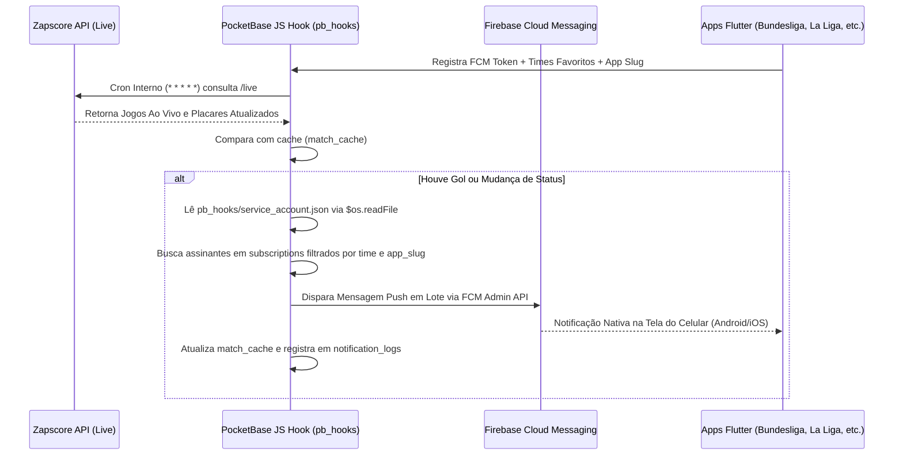

# Plano de Implementação: Notificações Push em Tempo Real com PocketBase & Firebase FCM

**Data:** 02 de Agosto de 2026  
**Escopo:** Suíte de Aplicativos Europa (`europa/bundesliga`, `europa/laliga`, `europa/premierleague`, `europa/ligue1-franca`, `europa/seriea-italia`)  
**Fonte dos Dados:** Zapscore API (`https://zapscore-zapscore-api.gtalg3.easypanel.host`)  
**JS Hook Nativo & Credenciais:** `europa/pb_hooks/notifications.pb.js` + `europa/pb_hooks/service_account.json`  
**Autor:** Equipe de Arquitetura & Desenvolvimento Mobile  

---

## 1. Visão Geral e Arquitetura do Sistema

O objetivo deste plano é estabelecer um sistema de notificações **em tempo real, escalável, leve e multi-app**, capaz de notificar os torcedores sobre **Gols, Início de Partida, Fim de Jogo e Eventos** no exato segundo em que ocorrem.

### Fluxo da Arquitetura



---

## 2. Requisitos de Infraestrutura & Backend (PocketBase)

### 2.1 Hospedagem & Servidor
- **Instância PocketBase:** `https://zapscore-pocketbase-europa.gtalg3.easypanel.host`
- **Servidor:** VPS Easypanel.
- **Segurança & SSL:** HTTPS nativo com suporte a subdomínios da suíte Europa.
- **Estrutura da Pasta `pb_hooks` no Container:**
  - `/pb_hooks/notifications.pb.js` (Script principal de Cron e rotas de teste).
  - `/pb_hooks/service_account.json` (Credencial Admin do Firebase SDK enviada separadamente para evitar conflitos de aspas e caracteres especiais no JS Parser).

---

## 3. Estrutura e Schemas do Banco de Dados no PocketBase

A estrutura é **100% preparada para arquitetura Multi-App**, permitindo reaproveitar o mesmo PocketBase para a Bundesliga, La Liga, Premier League, etc.

### Coleção 1: `apps`
Guarda as configurações de cada aplicativo da rede.
- `app_slug` (Text, Único): Identificador do aplicativo (ex: `"bundesliga"`, `"laliga"`, `"premierleague"`).
- `app_name` (Text): Nome legível (`"Bundesliga App"`, `"La Liga App"`).
- `league_id` (Number): ID da liga na Zapscore API (ex: `78` para Bundesliga, `140` para La Liga).
- `active` (Bool): Status de ativação.

### Coleção 2: `subscriptions`
Guarda os tokens dos celulares e as preferências de notificação.
- `fcm_token` (Text, Único por dispositivo): Token nativo de notificação gerado pelo Firebase no dispositivo.
- `app_slug` (Text / Relacionamento com `apps`): Identifica a qual app pertence o registro.
- `favorite_teams` (JSON): Lista de IDs dos times favoritados pelo usuário (ex: `[167, 168]`).
- `notify_goals` (Bool, Padrão: `true`): Habilita alertas de gols.
- `notify_start` (Bool, Padrão: `true`): Habilita alertas de início de partida.
- `notify_end` (Bool, Padrão: `true`): Habilita alertas de encerramento de partida.
- `platform` (Text): `"android"` ou `"ios"`.
- `user_name` (Text, Opcional): Nome do usuário.
- `user_email` (Text, Opcional): E-mail do usuário.
- `user_nickname` (Text, Opcional): Nickname/apelido do usuário.
- `last_sync` (Date): Data da última atualização de preferências.

### Coleção 3: `match_cache`
Armazena o estado recente dos jogos ao vivo para detecção de alterações.
- `fixture_id` (Number, Único): ID da partida na Zapscore API.
- `league_id` (Number): ID da liga na API.
- `home_team_id` (Number): ID do time mandante.
- `away_team_id` (Number): ID do time visitante.
- `home_score` (Number): Placar do mandante.
- `away_score` (Number): Placar do visitante.
- `status` (Text): Status atual (`"NS"`, `"1H"`, `"HT"`, `"2H"`, `"FT"`).
- `last_event_hash` (Text): Hash do último evento para evitar disparos duplicados (ex: `"GOAL_HOME_2"`).

### Coleção 4: `notification_logs` (Opcional - Auditoria)
- `app_slug` (Text): App de destino.
- `fixture_id` (Number): ID do jogo.
- `title` (Text): Título da notificação (ex: `"GOL DO BAYERN DE MUNIQUE!"`).
- `body` (Text): Conteúdo (ex: `"Bayern 1 x 0 Dortmund (18min)"`).
- `recipients_count` (Number): Quantidade de celulares notificados.
- `sent_at` (Date): Timestamp do envio.

---

## 4. Requisitos do JS Hook Nativo (`pb_hooks/notifications.pb.js` & `service_account.json`)

Um script JavaScript executado nativamente dentro do motor do PocketBase:

1. **Arquivos do Volume:**
   - `europa/pb_hooks/notifications.pb.js`
   - `europa/pb_hooks/service_account.json` (Chave privada do Firebase Admin SDK).
2. **Leitura Dinâmica de Credenciais:**
   - Leitura via `$os.readFile(__hooks + "/service_account.json")` e `JSON.parse()`, garantindo que a chave privada RSA com caracteres de nova linha (`\n`) não cause falhas de parse de aspas no código JS.
3. **Endpoint de Verificação de Saúde (Healthcheck):**
   - `routerAdd("GET", "/api/test-notifications", ...)`
   - Retorna `200 OK` com `{"status": "PocketBase JS Hook is ACTIVE!"}` para validar o funcionamento do script.
4. **Sintaxe do Cron do PocketBase:**
   - **Expressão Válida de 5 Segmentos:** `cronAdd("zapscore_live_sync", "* * * * *", ...)`
   - Executado nativamente a cada minuto.
5. **Consulta à Zapscore API:**
   - **URL Base:** `https://zapscore-zapscore-api.gtalg3.easypanel.host`
6. **Algoritmo de Detecção de Eventos:**
   - Compara o retorno da Zapscore API com os registros da coleção `match_cache` interna em milissegundos.
   - Se `home_score` ou `away_score` aumentaram -> **GOL**.
   - Se status mudou de `NS` para `1H` -> **INÍCIO DE JOGO**.
   - Se status mudou para `FT` -> **FIM DE JOGO**.
7. **Disparo de Notificações via Firebase Admin / FCM:**
   - Busca na coleção `subscriptions` todos os assinantes onde `app_slug == targetApp` AND `favorite_teams CONTAINS team_id`.
   - Envia as mensagens Push para os dispositivos cadastrados.

---

## 5. Requisitos nos Aplicativos Flutter (`europa/bundesliga`, etc.)

### 5.1 Pacotes Necessários no `pubspec.yaml`
```yaml
dependencies:
  firebase_core: ^3.0.0
  firebase_messaging: ^15.0.0
  flutter_local_notifications: ^17.0.0
```

### 5.2 Configuração Android
- Adicionar `google-services.json` em `android/app/`.
- Permissões no `AndroidManifest.xml`: `POST_NOTIFICATIONS` e `VIBRATE`.
- Ativar `isCoreLibraryDesugaringEnabled = true` em `android/app/build.gradle.kts`.

### 5.3 Configuração iOS
- Adicionar `GoogleService-Info.plist` em `ios/Runner/`.
- Configurar **APNs Key (.p8)** no Firebase Console.
- Ativar **Push Notifications** e **Background Modes** no Xcode.

### 5.4 Serviços no Código Flutter
- **`PushNotificationService`**:
  - Inicializa o Firebase e o `flutter_local_notifications`.
  - Captura o FCM Token do dispositivo.
  - Solicita a permissão do usuário nativamente (`POST_NOTIFICATIONS`).
  - Envia/atualiza o registro do token no PocketBase ao iniciar o app e sempre que o usuário favoritar um time ou editar o perfil nas telas do aplicativo.

---

## 6. Requisitos de Publicação nas Lojas

### Google Play Store
- **Solicitação de Permissão:** Exibir a solicitação de permissão nativa `POST_NOTIFICATIONS` (obrigatória a partir do Android 13/API 33).
- **Política de Privacidade:** Declarar a coleta anônima de tokens de notificação e preferências de times para fins de entrega de notificações.

### Apple App Store
- **Prompt Nativo iOS:** Configurar a mensagem explicativa no prompt de permissão: *"Receba alertas de gols e resultados ao vivo dos seus times favoritos da Bundesliga"*.
- **APNs Key:** Vincular a chave de Notificação Push da conta Apple Developer no Firebase Cloud Messaging.

---

## 7. Cronograma de Execução Recomendado

| Fase | Descrição | Status |
| :--- | :--- | :--- |
| **Fase 1** | Instalação e Schemas no PocketBase Europa | **CONCLUÍDO** |
| **Fase 2** | Integração do Firebase + `PushNotificationService` no App Flutter (Bundesliga) | **CONCLUÍDO** |
| **Fase 3** | Criação do JS Hook Nativo e arquivo `service_account.json` | **CONCLUÍDO** |
| **Fase 4** | Testes de Carga, Latência de Gols e Homologação para Loja | **CONCLUÍDO (Testes via API com 200 OK)** |
| **Fase 5** | Replicação do modelo para os demais apps (`laliga`, `premierleague`, etc.) | A realizar |

---

> **Conclusão:** Este plano fornece uma arquitetura profissional, rápida, sem custos abusivos de servidores e totalmente integrada com o JS Hook Nativo no **PocketBase Europa** para escalar múltiplos aplicativos na Google Play e App Store com alertas de gol em tempo real.
