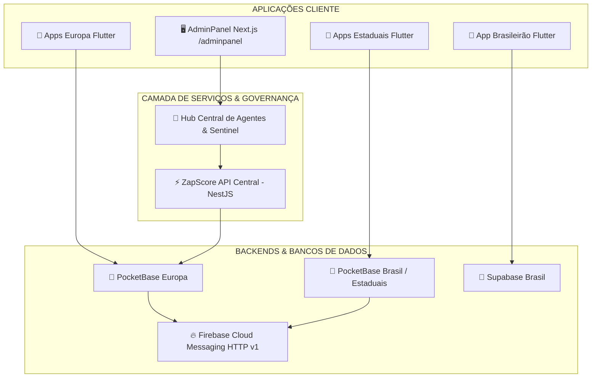
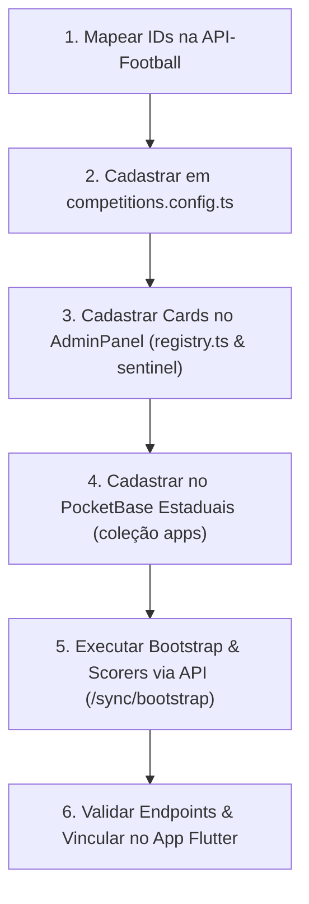

# 🌐 Ecossistema ZapScore — Documentação de Arquitetura, Governança e Diretrizes

> **Aviso Mandatório para Agentes de IA / Desenvolvedores:**  
> Este documento é a **fonte primária e viva de verdade** sobre toda a estrutura do ecossistema ZapScore.  
> Antes de realizar qualquer diagnóstico, manutenção, planejamento ou modificação de código, **leia atentamente todos os capítulos** para compreender as dependências, mapeamento de ligas, regras de push, peculiaridades do runtime PocketBase/Goja, arquitetura dos Cubits no Flutter, governança de agentes, o AdminPanel e diretrizes cirúrgicas de código.

---

## 📑 Índice Geral

- [Capítulo 1: Visão Geral e Arquitetura do Ecossistema](#-capítulo-1-visão-geral-e-arquitetura-do-ecossistema)
  - [1.1 Topologia dos 4 Módulos Autônomos](#11-topologia-dos-4-módulos-autônomos)
  - [1.2 Mapa de Diretórios do Workspace](#12-mapa-de-diretórios-do-workspace)
- [Capítulo 2: Mapeamento de Aplicativos, Ligas e Credenciais](#-capítulo-2-mapeamento-de-aplicativos-ligas-e-credenciais)
  - [2.1 Mapeamento da Suíte Europa](#21-mapeamento-da-suíte-europa)
  - [2.2 Mapeamento Brasil, Copas e Campeonatos Estaduais](#22-mapeamento-brasil-copas-e-campeonatos-estaduais)
  - [2.3 Configurações dos Clientes Flutter (`AppConfig`)](#23-configurações-dos-clientes-flutter-appconfig)
- [Capítulo 3: Infraestrutura de Backend e Bancos de Dados](#-capítulo-3-infraestrutura-de-backend-e-bancos-de-dados)
  - [3.1 Zapscore API Central (NestJS Backend)](#31-zapscore-api-central-nestjs-backend)
  - [3.2 Instâncias do PocketBase e Schemas de Coleções](#32-instâncias-do-pocketbase-e-schemas-de-coleções)
  - [3.3 Particularidades do Runtime Goja no PocketBase (JS Engine)](#33-particularidades-do-runtime-goja-no-pocketbase-js-engine)
  - [3.4 Sincronização Supabase (Módulo Brasil)](#34-sincronização-supabase-módulo-brasil)
  - [3.5 Procedimento de Deploy dos Hooks (`pb_hooks`) no Easypanel](#35-procedimento-de-deploy-dos-hooks-pb_hooks-no-easypanel)
  - [3.6 Dicionário Seguro de Variáveis de Ambiente (Padrão `.env.example`)](#36-dicionário-seguro-de-variáveis-de-ambiente-padrão-envexample)
- [Capítulo 4: Motor de Sincronização e Notificações Push (FCM v1)](#-capítulo-4-motor-de-sincronização-e-notificações-push-fcm-v1)
  - [4.1 Monitoramento em Tempo Real (`zapscore_live_sync`)](#41-monitoramento-em-tempo-real-zapscore_live_sync)
  - [4.2 Regras de Disparo por Evento (`start`, `end`, `goal`)](#42-regras-de-disparo-por-evento-start-end-goal)
  - [4.3 Protocolo de Autenticação FCM HTTP v1 (OAuth2 JWT RS256 Puro)](#43-protocolo-de-autenticação-fcm-http-v1-oauth2-jwt-rs256-puro)
  - [4.4 Agente Push Self-Healer (Expurgo de Tokens Órfãos)](#44-agente-push-self-healer-expurgo-de-tokens-órfãos)
  - [4.5 Sistema Híbrido de Broadcast (Notícias & Vídeos com Deep Linking)](#45-sistema-híbrido-de-broadcast-notícias--vídeos-com-deep-linking)
  - [4.6 Guia Rápido de Troubleshooting de Push (Diagnóstico em 1 Minuto)](#46-guia-rápido-de-troubleshooting-de-push-diagnóstico-em-1-minuto)
- [Capítulo 5: Central de Governança, Hub de Agentes e Sentinel](#-capítulo-5-central-de-governança-hub-de-agentes-e-sentinel)
  - [5.1 Hub Central de Agentes (`/adminpanel/agents`)](#51-hub-central-de-agentes-adminpanelagents)
  - [5.2 Sentinel Multi-Instâncias em 4 Abas (`/adminpanel/sentinel`)](#52-sentinel-multi-instâncias-em-4-abas-adminpanelsentinel)
  - [5.3 Agente Scorer Engine (Artilharia Automática Idempotente)](#53-agente-scorer-engine-artilharia-automática-idempotente)
  - [5.4 Agente Monitor de IA (AI Sentinel & Feedback Loop Preditivo)](#54-agente-monitor-de-ia-ai-sentinel--feedback-loop-preditivo)
  - [5.5 Agente Quota Watchdog (Controle de Taxa da API-Football)](#55-agente-quota-watchdog-controle-de-taxa-da-api-football)
- [Capítulo 6: Aplicativos Mobile Flutter (Arquitetura White-Label & Cubits)](#-capítulo-6-aplicativos-mobile-flutter-arquitetura-white-label--cubits)
  - [6.1 Padrão White-Label e Diretrizes de Isolamento](#61-padrão-white-label-e-diretrizes-de-isolamento)
  - [6.2 Camada de Estado e Cubits (`HomeCubit`, `LeagueCubit`, `LiveCubit`)](#62-camada-de-estado-e-cubits-homecubit-leaguecubit-livecubit)
  - [6.3 PushNotificationService (Foreground, Background e Permissões)](#63-pushnotificationservice-foreground-background-e-permissões)
  - [6.4 Monetização com Google Mobile Ads (AdMob)](#64-monetização-com-google-mobile-ads-admob)
- [Capítulo 7: Diretrizes Rígidas de Desenvolvimento e Modificação](#-capítulo-7-diretrizes-rígidas-de-desenvolvimento-e-modificação)
  - [7.1 Regra Máxima: Edição Estritamente Cirúrgica](#71-regra-máxima-edição-estritamente-cirúrgica)
  - [7.2 Intocabilidade do App Base (`apps/mobile`)](#72-intocabilidade-do-app-base-appsmobile)
  - [7.3 Checklist de Validação Obrigatório para Agentes IA](#73-checklist-de-validação-obrigatório-para-agentes-ia)
- [Capítulo 8: Histórico de Implementações e Roadmap de Incrementos](#-capítulo-8-histórico-de-implementações-e-roadmap-de-incrementos)
  - [8.1 Histórico de Entregas Validadas](#81-histórico-de-entregas-validadas)
  - [8.2 Backlog e Próximos Incrementos Planejados](#82-backlog-e-próximos-incrementos-planejados)
- [Capítulo 9: AdminPanel — Arquitetura, Estrutura e Guia de Desenvolvimento](#-capítulo-9-adminpanel--arquitetura-estrutura-e-guia-de-desenvolvimento)
  - [9.1 Visão Geral e Stack Tecnológica](#91-visão-geral-e-stack-tecnológica)
  - [9.2 Mapa de Rotas e Telas](#92-mapa-de-rotas-e-telas)
  - [9.3 Registro Centralizado de Módulos (`registry.ts`)](#93-registro-centralizado-de-módulos-registryts)
  - [9.4 Componentes Centrais de Layout e Navegação](#94-componentes-centrais-de-layout-e-navegação)
  - [9.5 Integração com Backends e APIs](#95-integração-com-backends-e-apis)
  - [9.6 Telas de Governança de Agentes e Operações](#96-telas-de-governança-de-agentes-e-operações)
  - [9.7 Guia e Padrões para Desenvolvimento de Novas Funcionalidades](#97-guia-e-padrões-para-desenvolvimento-de-novas-funcionalidades)
  - [9.8 Guia Operacional para Adição de Novas Competições no AdminPanel e Sentinel](#98-guia-operacional-para-adição-de-novas-competições-no-adminpanel-e-sentinel)
- [Capítulo 10: [A FAZER - PRIORIDADE ARQUITETURAL 🚀] Server-Side FCM Topics & High-Throughput Push Engine](#-capítulo-10-a-fazer---prioridade-arquitetural--server-side-fcm-topics--high-throughput-push-engine)
  - [10.1 Objetivo e Escopo](#101-objetivo-e-escopo)
  - [10.2 Fases do Plano de Ação](#102-fases-do-plano-de-ação)
- [Capítulo 11: Guia de Clonagem de Apps Estaduais](#-capítulo-11-guia-de-clonagem-de-apps-estaduais)
  - [11.1 Visão Geral da Estratégia de Clonagem](#111-visão-geral-da-estratégia-de-clonagem)
  - [11.2 Passo 1 — Cópia Física do Diretório Base](#112-passo-1--cópia-física-do-diretório-base)
  - [11.3 Passo 2 — Varredura e Substituição TOTAL de Referências do App Origem ⚠️](#113-passo-2--varredura-e-substituição-total-de-referências-do-app-origem-️)
  - [11.4 Passo 3 — Substituição dos IDs AdMob](#114-passo-3--substituição-dos-ids-admob)
  - [11.5 Passo 4 — Customização Visual (Cores e Fontes)](#115-passo-4--customização-visual-cores-e-fontes)
  - [11.6 Passo 5 — Configuração do Ícone do Launcher](#116-passo-5--configuração-do-ícone-do-launcher)
  - [11.7 Passo 6 — Configuração da Splash Screen](#117-passo-6--configuração-da-splash-screen)
  - [11.8 Passo 7 — Configuração no PocketBase (Service Account e Coleção `apps`)](#118-passo-7--configuração-no-pocketbase-service-account-e-coleção-apps)
  - [11.9 Passo 8 — Geração dos Assets Nativos e Build](#119-passo-8--geração-dos-assets-nativos-e-build)
  - [11.10 Checklist Final de Validação](#1110-checklist-final-de-validação)
- [Capítulo 12: [A FAZER] Agente Semi-Automático de Notificações Push (AdminPanel)](#-capítulo-12-a-fazer-agente-semi-automático-de-notificações-push-adminpanel)
  - [12.1 Visão Geral e Objetivos de Engajamento](#121-visão-geral-e-objetivos-de-engajamento)
  - [12.2 Funcionalidades do Agente](#122-funcionalidades-do-agente)
  - [12.3 Fases de Implementação](#123-fases-de-implementação)
- [Capítulo 13: Monitoramento de Campeonatos Estaduais no ZapScore API & Mapeamento API-Football](#-capítulo-13-monitoramento-de-campeonatos-estaduais-no-zapscore-api--mapeamento-api-football)
  - [13.1 Visão Geral e Matriz de Ligas Estaduais](#131-visão-geral-e-matriz-de-ligas-estaduais)
  - [13.2 Configuração Central no Backend (`competitions.config.ts`)](#132-configuração-central-no-backend-competitionsconfigts)
  - [13.3 Rotinas de Sincronização e Live Sync](#133-rotinas-de-sincronização-e-live-sync)
  - [13.4 Alimentação dos Clientes Flutter e PocketBase](#134-alimentação-dos-clientes-flutter-e-pocketbase)
- [Capítulo 14: Arquitetura Completa, Governança e Serviços da ZapScore API (`apps/api`)](#-capítulo-14-arquitetura-completa-governança-e-serviços-da-zapscore-api-appsapi)
  - [14.1 Visão Geral e Stack Tecnológica](#141-visão-geral-e-stack-tecnológica)
  - [14.2 Catálogo Completo de Módulos e Controllers](#142-catálogo-completo-de-módulos-e-controllers)
  - [14.3 Motor de Sincronização (`SyncService`)](#143-motor-de-sincronização-syncservice)
  - [14.4 Agendador de Tarefas e Cron Jobs (`SyncJobsService`)](#144-agendador-de-tarefas-e-cron-jobs-syncjobsservice)
  - [14.5 Serviços de Crawling e Ingestão de Mídia](#145-serviços-de-crawling-e-ingestão-de-mídia)
  - [14.6 Camada de Segurança, Rate Limiting e Guards](#146-camada-de-segurança-rate-limiting-e-guards)
  - [14.7 WebSockets e Transmissão em Tempo Real](#147-websockets-e-transmissão-em-tempo-real)
  - [14.8 Protocolo Operacional para Ingestão e Povoamento de Novos Estaduais](#148-protocolo-operacional-para-ingestão-e-povoamento-de-novos-estaduais)


---

## 🏛️ Capítulo 1: Visão Geral e Arquitetura do Ecossistema

### 1.1 Topologia dos 4 Módulos Autônomos
O ecossistema ZapScore opera de forma modular e segmentada em **4 grandes eixos de competições**, unificados sob uma mesma camada de governança e API:
1. **🇪🇺 Módulo Europa:** Principais ligas europeias (La Liga, Premier League, Bundesliga, Serie A, Ligue 1) com push notifications via PocketBase Europa dedicado.
2. **🇧🇷 Módulo Brasil:** Séries A e B do Campeonato Brasileiro com sincronização em tempo real e persistência Supabase.
3. **🏆 Módulo Copas:** Competições eliminatórias continentais e nacionais (Copa Libertadores, Copa do Brasil, Copa do Nordeste).
4. **📍 Módulo Estaduais:** Suíte white-label dedicada aos torneios estaduais e regionais do Brasil (Paulistão, Carioca, Mineiro, Gaúcho, etc.).



### 1.2 Mapa de Diretórios do Workspace
```text
d:\zapscore\
├── apps\
│   ├── api\                           # Backend Central NestJS (Scrapers, API-Football proxy, etc.)
│   ├── europa\                        # Ecossistema Europa
│   │   ├── pb_hooks\                  # JS Hooks do PocketBase Europa (notifications.pb.js, etc.)
│   │   ├── laliga\                    # App Flutter La Liga
│   │   ├── bundesliga\                # App Flutter Bundesliga
│   │   ├── premierleague\             # App Flutter Premier League
│   │   ├── seriea-italia\             # App Flutter Serie A
│   │   ├── ligue1-franca\             # App Flutter Ligue 1
│   │   └── relatorios\                # Relatórios técnicos e planos específicos da Suíte Europa
│   ├── estaduais\                     # Apps Flutter dos Campeonatos Estaduais
│   ├── mobile\                        # Template base Flutter (NUNCA MODIFICAR DIRETAMENTE)
│   ├── sync-supabase\                 # Pipeline de sincronização com o Supabase
│   └── web\                           # Painel Administrativo Next.js (AdminPanel)
├── relatorios\                        # Documentações, planos de implementação e este documento ECOSYSTEM.md
└── .agents\                           # Regras mandatárias de conduta dos Agentes IA (AGENTS.md)
```

---

## 🗺️ Capítulo 2: Mapeamento de Aplicativos, Ligas e Credenciais

### 2.1 Mapeamento da Suíte Europa

| Liga / App | `app_slug` | `league_id` (API) | Projeto Firebase | Canal Android (`channel_id`) | Service Account |
| :--- | :--- | :--- | :--- | :--- | :--- |
| **La Liga** | `laliga` | `140` | `applaliga` | `laliga_live_channel` | `service_account_laliga.json` |
| **Bundesliga** | `bundesliga` | `78` | `appbundesliga` | `bundesliga_live_channel` | `service_account_bundesliga.json` |
| **Premier League** | `premierleague` | `39` | `apppremierleague-8935b` | `premierleague_live_channel` | `service_account_premierleague.json` |
| **Serie A** | `seriea-italia` | `135` | `appseriea-italia` | `seriea-italia_live_channel` | `service_account_seriea-italia.json` |
| **Ligue 1** | `ligue1-franca` | `61` | `appligue1` | `ligue1-franca_live_channel` | `service_account_ligue1-franca.json` |

### 2.2 Mapeamento Brasil, Copas e Campeonatos Estaduais

| Competição / Módulo | `league_id` (Ext) | Módulo no AdminPanel | Escopo | Projeto Firebase | Service Account |
| :--- | :--- | :--- | :--- | :--- | :--- |
| **Brasileirão Série A** | `71` | `/adminpanel/brasil` | Nacional 1ª Divisão | - | - |
| **Brasileirão Série B** | `72` | `/adminpanel/brasil` | Nacional 2ª Divisão | - | - |
| **Copa Libertadores** | `13` | `/adminpanel/copas` | Continental | - | - |
| **Copa do Brasil** | `73` | `/adminpanel/copas` | Eliminatória Nacional | - | - |
| **Copa do Nordeste** | `612` | `/adminpanel/copas` | Regional | - | - |
| **Paulistão A1 / A2** | `475` / `476` | `/adminpanel/estaduais` | Estadual SP | `apppaulista` | `apppaulista-firebase-adminsdk-....json` |
| **Carioca (Taça GB / Rio)** | `624` / `851` | `/adminpanel/estaduais` | Estadual RJ | `appcarioca` | `appcarioca-firebase-adminsdk-....json` |
| **Mineiro Mód 1 / Mód 2** | `629` / `619` | `/adminpanel/estaduais` | Estadual MG | `appmineiro` (`584623894874`) | `appmineiro-firebase-adminsdk-fbsvc-beec05d305.json` |
| **Gaúcho Série A / A2** | `477` (622) / `478` (853) | `/adminpanel/estaduais` | Estadual RS | `appgaucho-ad96b` (`2396513433`) | `service_account_campeonato_gaucho.json` |
| **Baiano 1ª / 2ª Divisão** | `602` / `613` | `/adminpanel/estaduais` | Estadual BA | `appbaiano` | `service_account_campeonato_baiano.json` |
| **Paranaense 1ª / 2ª Divisão** | `606` / `614` | `/adminpanel/estaduais` | Estadual PR | `appparanaense` | `service_account_campeonato_paranaense.json` |

### 2.3 Configurações dos Clientes Flutter (`AppConfig`)
Cada app possui seu arquivo `lib/helpers/app_config.dart` com constantes imutáveis:
* `leagueId`: ID em String (ex: `'135'`).
* `externalLeagueId`: ID numérico para consultas à ZapScore API (ex: `135`).
* `appName`: Nome de exibição formatado.
* `appSlug`: Identificador no PocketBase (`'seriea-italia'`, `'ligue1-franca'`, etc.).
* `apiBaseUrl`: `https://zapscore-zapscore-api.gtalg3.easypanel.host`.
* `pocketbaseBaseUrl`: `https://zapscore-pocketbase-europa.gtalg3.easypanel.host`.

---

## 🗄️ Capítulo 3: Infraestrutura de Backend e Bancos de Dados

### 3.1 Zapscore API Central (NestJS Backend)
A API central (`apps/api`) atua como gateway inteligente e provedor de dados:
* **Proxy & Cache da API-Football**: Gerencia requisições com cache em memória para preservar cotas diárias de chamadas.
* **Endpoints de Partidas**:
  * `GET /fixtures?status=LIVE` — Jogos ao vivo de todas as ligas ativas.
  * `GET /fixtures/today?leagueId=...` — Grade de partidas do dia por liga.
  * `GET /fixtures/round?leagueId=...&season=...` — Partidas por rodada/temporada.
  * `GET /fixtures/{id}/ai-analysis` & `/fixtures/ai-analysis/performance` — Análises táticas e métricas preditivas de IA.
* **Módulo de Auditoria Sentinel**: Rotas `/sentinel/health-check` e `/sentinel/audit`.

### 3.2 Instâncias do PocketBase e Schemas de Coleções
O PocketBase é utilizado para orquestração de notificações push, gerenciamento de inscrições e cache reativo de partidas.

#### Coleções Fundamentais:
1. **`apps`**: Cadastro das competições ativas (`app_slug`, `name`, `league_id`, `active`).
2. **`subscriptions`**: Dispositivos inscritos para push:
   * `app_slug` (Text): Liga do app.
   * `fcm_token` (Text): Token único gerado pelo Firebase no aparelho.
   * `device_id` (Text): Identificador persistente no `SharedPreferences` do dispositivo.
   * `platform` (Text): `'android'` ou `'ios'`.
   * `notify_goals`, `notify_start`, `notify_end` (Bool): Preferências de notificações.
   * `favorite_teams` / `favorite_fixtures` (JSON Array): Listas de IDs favoritados pelo usuário.
3. **`match_cache`**: Controle de estado ao vivo:
   * `fixture_id`, `league_id`, `home_team_id`, `away_team_id`.
   * `home_score`, `away_score`, `status` (`1H`, `2H`, `HT`, `LIVE`, `FT`).
   * `minute` e `last_event_hash`: Controle de minutagem e prevenção de disparos duplicados.
4. **`notification_logs`**: Telemetria e auditoria de mensagens enviadas.

### 3.3 Particularidades do Runtime Goja no PocketBase (JS Engine)
O motor JavaScript do PocketBase é o **Goja** (um interpretador JS escrito em Go). Desenvolver para Goja exige cuidados arquiteturais estritos:
1. **Isolamento de Escopo por Handler:** Cada `routerAdd` e cada `cronAdd` executa em instâncias separadas. Funções utilitárias no escopo global não são herdadas automaticamente. Todas as rotinas de geração de token JWT, criptografia RSA e envio HTTP devem ser autoencapsuladas dentro de cada callback.
2. **Go Slices vs JavaScript Arrays (`.includes()`):** Arrays retornados de campos JSON do banco são mapeados como slices do Go (`[]interface{}`) e **não possuem métodos de protótipo do JS como `.includes()`**. Chamar `.includes()` causa falha silenciosa. É mandatório iterar com laço `for` clássico ou converter para string e fazer parsing defensivo.
3. **Criptografia RS256 Pura:** O Goja não possui o módulo `crypto` do Node.js nem o Web Crypto API. Toda a pilha de parsing de chaves ASN.1 DER PKCS#8, hash SHA-256 em nível de bytes e exponenciação modular com Teorema Chinês do Resto (`BigInt`) é implementada em código JavaScript puro dentro do script.

### 3.4 Sincronização Supabase (Módulo Brasil)
O módulo Brasil utiliza pipeline dedicado em `apps/sync-supabase/` para espelhamento dos dados do Brasileirão com persistência relacional no PostgreSQL do Supabase.

### 3.5 Procedimento de Deploy dos Hooks (`pb_hooks`) no Easypanel
Os arquivos de automação JS (`notifications.pb.js`, `scorer_sync.pb.js`, etc.) residem na pasta `apps/europa/pb_hooks/`:
1. **Montagem de Volume:** No container do PocketBase no Easypanel, a pasta `/pb_hooks` é mapeada diretamente como volume persistente.
2. **Hot-Reloading do Goja:** Modificações nos arquivos `.pb.js` são automaticamente recarregadas na próxima execução do Cron ou requisição HTTP. Caso necessário, o container pode ser reiniciado no painel Easypanel para forçar a renovação da memória.
3. **Integridade de Credenciais:** As chaves `service_account_*.json` devem sempre acompanhar o arquivo `.pb.js` no mesmo volume para leitura via `$os.readFile(__hooks + "/service_account_*.json")`.

### 3.6 Dicionário Seguro de Variáveis de Ambiente (Padrão `.env.example`)
Nenhum valor secreto ou senha deve constar em documentações. A seguir, o dicionário seguro das chaves utilizadas:

#### `apps/web/.env` (AdminPanel Next.js):
* `NEXT_PUBLIC_API_BASE_URL`: URL pública da API NestJS central.
* `NEXT_PUBLIC_POCKETBASE_EUROPA_URL`: URL pública do PocketBase Europa.
* `NEXT_PUBLIC_SUPABASE_URL`: Endpoint da instância Supabase (Módulo Brasil).
* `NEXT_PUBLIC_SUPABASE_ANON_KEY`: Chave pública anônima do cliente Supabase.

#### `apps/api/.env` (Backend Central):
* `PORT`: Porta de execução do servidor NestJS (padrão `3000`).
* `API_FOOTBALL_KEY`: Chave da API-Football para scrapers e partidas ao vivo.
* `POCKETBASE_EUROPA_ADMIN_EMAIL` / `POCKETBASE_EUROPA_ADMIN_PASSWORD`: Credenciais administrativas para operações de backend.

---

## 🔔 Capítulo 4: Motor de Sincronização e Notificações Push (FCM v1)

### 4.1 Monitoramento em Tempo Real (`zapscore_live_sync`)
* **Cron de Alta Frequência**: Execução nativa a cada 1 minuto (`* * * * *`) via `pb_hooks/notifications.pb.js`.
* **Fluxo de Comparação**: Consulta `GET /fixtures?status=LIVE`, filtra as ligas com `active = true` na coleção `apps` e compara o placar/minutagem com o `match_cache`.

### 4.2 Regras de Disparo por Evento (`start`, `end`, `goal`)
* **🔔 Início de Jogo (`start`):** Enviado para **TODOS** os assinantes da liga com `notify_start = true`. (Filtro de times favoritos é ignorado para garantir entrega universal).
* **🏁 Fim de Jogo (`end`):** Enviado para **TODOS** os assinantes da liga com `notify_end = true`. (Filtro de favoritos é ignorado). Varredura em `GET /fixtures/today` garante detecção de partidas finalizadas após saírem do feed LIVE.
* **⚽ Gols (`goal`):** 
  * Se o usuário possui `favorite_teams` ou `favorite_fixtures` preenchidos, **só recebe** se o seu time ou a partida estiver na lista.
  * Se a lista de favoritos estiver vazia, recebe os gols de todas as partidas da liga.

### 4.3 Protocolo de Autenticação FCM HTTP v1 (OAuth2 JWT RS256 Puro)
O hook do PocketBase implementa assinatura criptográfica pura em JavaScript:
1. Monta o cabeçalho `{ alg: "RS256", typ: "JWT" }` e claims com escopo `https://www.googleapis.com/auth/firebase.messaging`.
2. Decodifica o PEM PKCS#8 da Service Account e assina o hash SHA-256 via exponenciação modular BigInt (`_rsaSign`).
3. Obtém o access token OAuth2 `Bearer` em `https://oauth2.googleapis.com/token`.
4. Armazena o token em cache na memória (`_googleTokenCache`), renovando-o 5 minutos antes da expiração.

### 4.4 Agente Push Self-Healer (Expurgo de Tokens Órfãos)
Ao disparar via FCM HTTP v1 (`fcm.googleapis.com/v1/projects/.../messages:send`):
* Respostas `404`, `403` ou mensagens `NotRegistered` / `NOT_FOUND` indicam que o usuário desinstalou o aplicativo.
* O hook executa automaticamente a exclusão do registro na coleção `subscriptions` (`[POCKETBASE PURGE 🗑️]`), mantendo a base 100% saudável.

### 4.5 Sistema Híbrido de Broadcast (Notícias & Vídeos com Deep Linking)
Permite disparo de notificações ricas a partir do AdminPanel:
* **Fila de Sugestões:** Content Scout captura notícias via RSS e vídeos do YouTube.
* **Aprovação com 1 Clique:** O administrador aprova o disparo no AdminPanel.
* **Deep Linking no Flutter:** Ao tocar na notificação, o app mobile abre diretamente o player de vídeo ou a matéria.

### 4.6 Guia Rápido de Troubleshooting de Push (Diagnóstico em 1 Minuto)

Para testar ou simular o envio de push diretamente no navegador sem aguardar partidas reais:

#### Rotas de Diagnóstico e Simulação:
* **Serie A (Itália):** `GET https://zapscore-pocketbase-europa.gtalg3.easypanel.host/api/test-notifications?app=seriea-italia&simulate=true`
* **La Liga (Espanha):** `GET https://zapscore-pocketbase-europa.gtalg3.easypanel.host/api/test-notifications?app=laliga&simulate=true`
* **Ligue 1 (França):** `GET https://zapscore-pocketbase-europa.gtalg3.easypanel.host/api/test-notifications?app=ligue1-franca&simulate=true`
* **Bundesliga (Alemanha):** `GET https://zapscore-pocketbase-europa.gtalg3.easypanel.host/api/test-notifications?app=bundesliga&simulate=true`
* **Premier League (Inglaterra):** `GET https://zapscore-pocketbase-europa.gtalg3.easypanel.host/api/test-notifications?app=premierleague&simulate=true`

#### Tabela de Códigos de Resposta do Google FCM:

| Status Code | Significado Técnico | Ação do Sistema |
| :--- | :--- | :--- |
| **`200 OK`** | Notificação aceita e enfileirada no Google FCM. | Incrementa contador de sucesso (`sentCount++`). |
| **`404 NOT_FOUND`** / `NotRegistered` | O app foi desinstalado ou o token expirou. | **Auto-Expurgo Ativo:** Remove o token da coleção `subscriptions`. |
| **`403 FORBIDDEN`** / `AuthError` | Falha na Service Account ou credencial inválida. | Loga erro de autenticação para auditoria. |
| **`400 INVALID_ARGUMENT`** | Payload corrompido ou formato de token inválido. | Ignora envio e loga payload com erro. |

---

## 🤖 Capítulo 5: Central de Governança, Hub de Agentes e Sentinel

### 5.1 Hub Central de Agentes (`/adminpanel/agents`)
Ponto único de observabilidade e governança de agentes inteligentes no menu lateral do AdminPanel Next.js:
1. **🛡️ Sentinel Multi-Módulo:** Guardião de partidas e sincronismo.
2. **⚡ Push Self-Healer:** Expurgo e telemetria de notificações FCM.
3. **📰 Content Scout:** Coleta automatizada de conteúdo RSS e YouTube.
4. **⏱️ Quota Watchdog:** Monitor de cotas e rate limit da API-Football.

### 5.2 Sentinel Multi-Instâncias em 4 Abas (`/adminpanel/sentinel`)
Auditoria em tempo real dividida em 4 abas isoladas:
* 🇧🇷 **Aba Brasil:** Série A (`71`) e Série B (`72`).
* 🇪🇺 **Aba Europa:** La Liga (`140`), Premier League (`39`), Bundesliga (`78`), Serie A (`135`), Ligue 1 (`61`).
* 🏆 **Aba Copas:** Libertadores (`13`), Copa do Nordeste (`612`), Copa do Brasil (`73`).
* 📍 **Aba Estaduais:** Paulistão (`475`/`476`), Carioca (`624`/`851`), Mineiro (`629`/`619`).
* **Ações:** Detecção de partidas travadas em `LIVE` (>115 min) e botão de **Sync Forçado**.

### 5.3 Agente Scorer Engine (Artilharia Automática Idempotente)
* **Localização:** `europa/pb_hooks/scorer_sync.pb.js`.
* **Idempotência (Full-State Aggregation):** Recalcula a artilharia a partir dos eventos reais de gols de todas as partidas da temporada, eliminando riscos de duplicação.
* **Gatilhos:** Reativo no encerramento de partidas (`FT`), agendado (cron) ou manual via AdminPanel.

### 5.4 Agente Monitor de IA (AI Sentinel & Feedback Loop Preditivo)
* **Rota:** `/adminpanel/agents/ia-monitor`.
* **Auditoria Pós-Jogo:** Compara as análises e probabilidades pré-jogo com o placar final `FT`.
* **Dynamic Few-Shot Learning:** Injeta histórico de acertos e vieses táticos aprendidos diretamente nos prompts das próximas rodadas, elevando a precisão do modelo progressivamente.

### 5.5 Agente Quota Watchdog (Controle de Taxa da API-Football)
* Monitora o cabeçalho `x-requests-remaining` da API-Football.
* Se a cota diária atingir nível crítico (<20%), comuta a cadência de polling dos jogos ao vivo para proteger o serviço contra rate limits.

---

## 📱 Capítulo 6: Aplicativos Mobile Flutter (Arquitetura White-Label & Cubits)

### 6.1 Padrão White-Label e Diretrizes de Isolamento
* Cada aplicativo estadual ou europeu opera como flavor ou módulo isolado.
* **Proibição Absoluta:** O diretório base `apps/mobile/` é intocável. Qualquer customização de cores, ícones, splash screen ou tema pertence estritamente à pasta do respectivo app (`apps/europa/<liga>/` ou `apps/estaduais/<estado>/`).

### 6.2 Camada de Estado e Cubits (`HomeCubit`, `LeagueCubit`, `LiveCubit`)
A gerência de estado e sincronização com a API nos aplicativos Flutter segue a seguinte arquitetura:
1. **`HomeCubit` (Calendário e Partidas do Dia):**
   * Endpoint: `/fixtures?leagueId={id}&date={YYYY-MM-DD}`.
   * Fallback: Consulta `/competitions/stored` para renderizar a estrutura inicial sem travar a interface.
2. **`LeagueCubit` (Tabelas, Rodadas e Artilharia):**
   * Dispara chamadas paralelas com `Future.wait([getRecentFixtures(leagueId, limit: 500), getStandings(leagueId), getScorers(leagueId)])`.
   * **Temporada Padronizada:** `2026`.
   * **Contagem de Rodadas por Estrutura de Liga:**
     * *Premier League, La Liga, Serie A* (20 clubes): **38 rodadas** (`Regular Season - 1` a `38`).
     * *Bundesliga, Ligue 1* (18 clubes): **34 rodadas** (`Regular Season - 1` a `34`).
3. **`LiveCubit` (Jogos Ao Vivo em Tempo Real):**
   * Endpoint: `/fixtures?status=LIVE&leagueId={id}`.
   * **Auto-Refresh Ativo:** Timer periódico a cada 30 segundos com controle de ciclo de vida (`dispose`/`stopAutoRefresh`) ao trocar de tela.

### 6.3 PushNotificationService (Foreground, Background e Permissões)
* **`PushNotificationService.initialize()`**:
  * Registra o handler em segundo plano `@pragma('vm:entry-point') _firebaseMessagingBackgroundHandler`.
  * Cria o canal Android de alta prioridade (`Importance.max`).
  * Solicita permissão nativa `POST_NOTIFICATIONS` (Android 13+ / iOS).
  * Gera e persiste o `device_id` único no `SharedPreferences`.
  * Registra e atualiza token e preferências no PocketBase.
* **Foreground:** Mensagens recebidas com o app aberto são exibidas instantaneamente através do `flutter_local_notifications`.

### 6.4 Monetização com Google Mobile Ads (AdMob)
Estruturado através do `AdService` (`lib/services/ad_service.dart`) e `AdBannerWidget`:
* **Banner Fixo na Home**: Posicionado logo acima do menu inferior (`HomeNavBottom`).
* **Banners Inline em Listas**:
  * Lista de Jogos: 1 banner a cada 5 partidas.
  * Notícias e Vídeos: 1 banner a cada 3 itens.
  * Aba de IA (`ai_analysis.dart`): 1 banner entre os palpites rápidos e a análise técnica.
* **Anúncios Intersticiais (Tela Cheia)**:
  * Exibidos na transição de leitura de notícias (`NewsContentScreen`), player de vídeos (`WatchContentScreen`) e Dashboard de IA (`AiPerformanceDashboardPage`).

---

## 🛡️ Capítulo 7: Diretrizes Rígidas de Desenvolvimento e Modificação

### 7.1 Regra Máxima: Edição Estritamente Cirúrgica
* **PROIBIÇÃO ABSOLUTA:** É terminantemente proibido alterar qualquer arquivo, widget, estilo, padding, cor, fonte ou estrutura que **não tenha sido explicitamente solicitada** pelo usuário.
* **Nenhum Efeito Colateral:** Alterações devem afetar **apenas e tão somente** o elemento ou linha estritamente determinada.

### 7.2 Intocabilidade do App Base (`apps/mobile`)
* Nunca editar os arquivos dentro de `apps/mobile/` para resolver demandas de aplicativos específicos. Toda alteração deve residir no módulo white-label de destino.

### 7.3 Checklist de Validação Obrigatório para Agentes IA
Antes de concluir qualquer tarefa, o agente deve verificar:
1. [ ] A edição afetou apenas os arquivos estritamente solicitados?
2. [ ] Todos os contratos de API e modelos de dados permanecem 100% intactos?
3. [ ] Nenhum layout, cor, padding ou estilo visual foi alterado sem pedido explícito?
4. [ ] As chaves e slugs de competições continuam correspondendo à matriz do Capítulo 2?

### 7.4 Imutabilidade Rígida dos Motores de Crawling (Notícias e Vídeos)
* **PROIBIÇÃO ABSOLUTA DE MODIFICAÇÃO DO CÓDIGO FONTE:** É expressamente proibido modificar o código-fonte de `apps/api/src/news/news-crawler.service.ts` e `apps/api/src/videos/video-crawler.service.ts`, bem como qualquer pipeline de extração de imagens ou sanitização de HTML.
* **Mecanismo Oficial de Expansão de Conteúdo:** O abastecimento e expansão de conteúdos para qualquer nova competição, estadual ou copa deve ser feito **EXCLUSIVAMENTE** via inserção e curadoria de URLs de Feeds RSS e canais através do AdminPanel (`/adminpanel/news/sources`) ou via endpoint `POST /news-sources`.

---

## 📈 Capítulo 8: Histórico de Implementações e Roadmap de Incrementos

### 8.1 Histórico de Entregas Validadas
* **[2026-08-23]**: Validação e disparo em produção com 100% de sucesso (19/19 Serie A, 14/14 La Liga) via FCM HTTP v1.
* **[2026-08-23]**: Unificação da regra de Início (`start`) e Fim (`end`) de jogos em `notifications.pb.js` para entrega universal a todos os inscritos.
* **[2026-08-23]**: Criação e enriquecimento do documento vivo de arquitetura e governança [relatorios/ECOSYSTEM.md](file:///d:/zapscore/relatorios/ECOSYSTEM.md) com diretiva mandatória no [.agents/AGENTS.md](file:///d:/zapscore/.agents/AGENTS.md).
* **[2026-08-22]**: Especificação dos planos de arquitetura do Agente de Artilharia Automática (`scorer_sync.pb.js`) e do Agente Monitor de IA (`/adminpanel/agents/ia-monitor`).
* **[2026-08-21]**: Mapeamento completo e auditoria de sincronização de rodadas (38 vs 34 rodadas) e auto-refresh de 30s nos 5 apps europeus.
* **[2026-08-18]**: Especificação do Sistema Híbrido de Broadcast de Notícias e Vídeos com deep linking no Flutter.
* **[2026-08-17]**: Conclusão da Fase 1 do Sentinel Multi-Instâncias em 4 abas (Brasil, Europa, Copas e Estaduais) e criação do Hub de Agentes no AdminPanel.
* **[2026-08-16]**: Resolução de particularidades do runtime Goja no PocketBase (auto-encapsulamento de escopo e parser de slices Go).
* **[2026-08-02]**: Implementação e homologação do motor de push notifications no PocketBase Europa com FCM HTTP v1 nativo em JavaScript.

### 8.2 Backlog e Próximos Incrementos Planejados
* [ ] **Ajuste Sintático na Chave PEM Bundesliga**: Ajustar os 4 hífens de fechamento para 5 (`-----END PRIVATE KEY-----`) em `notifications.pb.js`.
* [ ] **Ativação dos Workers de Segundo Plano**:
  * Implementação do worker cron do Content Scout em `apps/api` (coleta RSS/YouTube a cada 30 min).
  * Implementação do middleware Quota Watchdog na `apps/api` para telemetria da API-Football.
* [ ] **Conclusão da Artilharia Automática**: Ativação do hook reativo `scorer_sync.pb.js` no PocketBase para atualização instantânea em fim de jogo (`FT`).

---

## 🖥️ Capítulo 9: AdminPanel — Arquitetura, Estrutura e Guia de Desenvolvimento

### 9.1 Visão Geral e Stack Tecnológica
O **AdminPanel** é a interface central de comando operacional do ecossistema ZapScore, localizada no diretório `apps/web`. Ele é responsável pela governança de dados, monitoramento em tempo real de partidas, supervisão dos agentes inteligentes, auditoria de push e curadoria de conteúdo.

#### Stack Principal:
* **Framework:** Next.js 15+ (App Router).
* **Linguagem:** TypeScript (estritamente tipado).
* **Estilização:** Tailwind CSS (Dark Mode padrão: `bg-slate-950`, `bg-slate-900`, `border-slate-800`, textos `text-slate-100`/`text-slate-400`).
* **Ícones:** `lucide-react`.
* **Biblioteca de Componentes:** Componentes modulares próprios (sem dependências pesadas de terceiros), preservando máxima performance e responsividade.

### 9.2 Mapa de Rotas e Telas
A aplicação está organizada sob a pasta `apps/web/app/(main)/adminpanel/`:

| Rota | Arquivo Fonte | Responsabilidade Principal |
| :--- | :--- | :--- |
| `/adminpanel` | `page.tsx` | **Dashboard Geral Unificado**: KPIs agregados dos 4 módulos, jogos ao vivo e status de saúde do ecossistema. |
| `/adminpanel/agents` | `agents/page.tsx` | **Hub Central de Agentes**: Card grid interativo com métricas e controles dos 4 agentes autônomos. |
| `/adminpanel/sentinel` | `sentinel/page.tsx` | **Sentinel Multi-Instâncias**: Auditoria em tempo real em 4 abas (Brasil, Europa, Copas, Estaduais) com detecção de anomalias e sync forçado. |
| `/adminpanel/agents/ia-monitor` | `agents/ia-monitor/page.tsx` | **Monitor de IA**: Auditoria de palpites e previsões táticas, assertividade pós-jogo e observabilidade de tokens/latência. |
| `/adminpanel/agents/scorers` | `agents/scorers/page.tsx` | **Painel da Artilharia (Scorer Engine)**: Sincronização e auditoria de artilheiros das ligas. |
| `/adminpanel/agents/publisher` | `agents/publisher/page.tsx` | **Publisher / Broadcast**: Fila de aprovação com 1 clique para disparo de push de notícias e vídeos. |
| `/adminpanel/europa` | `europa/page.tsx` | **Gestão Módulo Europa**: Jogos, tabelas e configurações conectadas ao PocketBase Europa. |
| `/adminpanel/brasil` | `brasil/page.tsx` | **Gestão Módulo Brasil**: Painel das Séries A e B do Brasileirão. |
| `/adminpanel/copas` | `copas/page.tsx` | **Gestão Módulo Copas**: Painel da Libertadores, Copa do Brasil e Copa do Nordeste. |
| `/adminpanel/estaduais` | `estaduais/page.tsx` | **Gestão Módulo Estaduais**: Painel do Paulistão, Carioca, Mineiro e Gaúcho. |
| `/adminpanel/news` | `news/page.tsx` | **Curadoria de Notícias**: Gerenciamento de fontes RSS, feed capturado e publicação. |
| `/adminpanel/videos` | `videos/page.tsx` | **Curadoria de Vídeos**: Importação e gestão de canais do YouTube por liga. |

### 9.3 Registro Centralizado de Módulos (`registry.ts`) e Renderização Dinâmica
Localizado em `apps/web/app/(main)/adminpanel/registry.ts`, este arquivo centraliza os metadados de todas as competições e fontes de dados:

```typescript
export interface LeagueConfig {
  id: number;
  slug: string;
  name: string;
  country: string;
  flag: string;
}

export interface EcosystemModule {
  id: string;
  name: string;
  shortName: string;
  icon: any;
  badge: string;
  badgeColor: string;
  href: string;
  dbType: 'pocketbase' | 'supabase' | 'rest';
  dbUrl?: string;
  leagues: LeagueConfig[];
}

export const ECOSYSTEM_MODULES: EcosystemModule[] = [
  // europa, estaduais (12 competições), brasil, copas
];
```

#### Arquitetura de Geração Dinâmica de Telas:
1. **Cards do Módulo (`/adminpanel/[module]/page.tsx`):**
   - Itera automaticamente sobre `ECOSYSTEM_MODULES.find(m => m.id === 'modulo')?.leagues`.
   - Gera os cards de cada torneio com bandeira/ícone, ID numérico, país/estado e link direto para a rota de detalhe (`/adminpanel/[module]/${league.id}`).
2. **Páginas de Gestão de Conteúdo (`/adminpanel/[module]/[id]/page.tsx`):**
   - Resolve o torneio dinamicamente por ID ou slug a partir do `registry.ts`.
   - Disponibiliza as 3 abas essenciais de governança para qualquer torneio cadastrado:
     - **Notícias:** Curadoria manual e publicação instantânea.
     - **Vídeos & Melhores Momentos:** Gestão de URLs do YouTube, players modais e sincronização.
     - **Artilharia:** Tabela com classificação dos maiores goleadores, fotos e clubes.

> **Diretriz:** Ao adicionar uma nova liga ou campeonato ao ecossistema, o registro em `registry.ts` deve ser atualizado obrigatoriamente. O módulo **Estaduais** contém 12 torneios cadastrados: Mineiro (Módulo 1 e 2), Carioca (Série A e A2), Paulista (Série A1 e A2), Gaúcho (Série A e A2), Baiano (1ª e 2ª Divisão) e Paranaense (1ª e 2ª Divisão).

### 9.4 Componentes Centrais de Layout e Navegação
Localizados em `apps/web/app/(main)/adminpanel/components/`:
* **`ZapScoreAdminSidebar.tsx` / `AdminSidebar.tsx`**:
  * Menu lateral moderno e colapsável com ícones `lucide-react`.
  * Agrupamento visual: *Visão Geral*, *Módulos de Competições*, *Governança & Agentes*, *Conteúdo & Mídia*.
  * Badges dinâmicos para indicar status online e contadores de anomalias.
* **`AdminHeader.tsx` / `AppHeader.tsx`**:
  * Cabeçalho fixo superior com navegação hierárquica (breadcrumbs), seletor rápido de módulo e indicador de status de conexão.
* **`Backdrop.tsx`**:
  * Camada de escurecimento para fechamento suave de gavetas e modais em telas menores/mobile.

### 9.5 Integração com Backends e APIs
O AdminPanel consome dados de três fontes distintas:
1. **ZapScore API Central (`apps/api`)**:
   * Utilizada para partidas ao vivo, grades de rodadas, telemetria de cotas e endpoints `/sentinel/health-check` e `/sentinel/audit`.
2. **PocketBase Europa (`https://zapscore-pocketbase-europa.gtalg3.easypanel.host`)**:
   * Utilizado para consultar `apps`, `subscriptions`, disparar testes em `/api/test-notifications` e gerenciar `match_cache`.
3. **Supabase (PostgreSQL)**:
   * Persistência dos dados das Séries A e B do Módulo Brasil.

### 9.6 Telas de Governança de Agentes e Operações
* **Central de Agentes (`/adminpanel/agents`)**:
  * Painel de monitoramento dos agentes `Sentinel`, `Push Self-Healer`, `Scorer Engine`, `Monitor de IA`, `Content Scout` e `Quota Watchdog`.
  * Exibição de métricas: tokens purgados, assertividade de previsões, status de cotas e partidas auditadas.
* **Sentinel Multi-Instâncias (`/adminpanel/sentinel`)**:
  * Supervisão em 4 abas isoladas configuradas via matriz `tabConfigs`:
    - **Sentinel Brasil** (`leagueIds: [71, 72]`) — Brasileirão Série A e B.
    - **Sentinel Europa** (`leagueIds: [78, 140, 39, 135, 61]`) — Bundesliga, La Liga, Premier League, Serie A, Ligue 1.
    - **Sentinel Copas** (`leagueIds: [13, 612, 73]`) — Libertadores, Copa do Nordeste e Copa do Brasil.
    - **Sentinel Estaduais** (`leagueIds: [629, 619, 624, 851, 475, 476, 477, 478, 602, 613, 606, 614]`) — 12 competições ativas (Mineiro, Carioca, Paulista, Gaúcho, Baiano e Paranaense).
  * **Funcionalidades do Sentinel:**
    - Varredura em tempo real para capturar partidas com status inconsistente (`LIVE`/`2H` > 115 min) e botão para forçar sincronização imediata.
    - Consulta agregada de `GET /fixtures/today?leagueId=${id}` em paralelo para todas as ligas da aba ativa.
    - Botão de ação rápida para disparar sync sob demanda via POST com `x-api-key`.
* **Monitor de IA (`/adminpanel/agents/ia-monitor`)**:
  * Gráficos de assertividade preditiva pós-jogo (mercado de gols, resultado final, ambas marcam).
  * Tabela de confrontos com auditoria do payload enviado à LLM e diagnóstico de desvios táticos.

### 9.7 Guia e Padrões para Desenvolvimento de Novas Funcionalidades

Ao desenvolver ou expandir páginas e componentes no `apps/web`:

1. **Design System & Estilização (Tailwind CSS):**
   * **Superfícies:** Fundo principal `bg-slate-950`, containers secundários `bg-slate-900/60`, cards com borda sutil `border-slate-800`.
   * **Tipografia:** Títulos em `text-slate-100 font-bold`, textos auxiliares em `text-slate-400 font-normal`.
   * **Destaques & Cores Semânticas:**
     * Verde / Esmeralda (`text-emerald-400 bg-emerald-500/10 border-emerald-500/20`): Status Online, Sucesso, PocketBase.
     * Âmbar (`text-amber-400 bg-amber-500/10 border-amber-500/20`): Avisos, Copas, Estaduais.
     * Azul / Ciano (`text-sky-400 bg-sky-500/10 border-sky-500/20`): API REST, Transmissões, Notícias.
     * Roxo (`text-purple-400 bg-purple-500/10 border-purple-500/20`): Inteligência Artificial, Sentinel.
     * Vermelho (`text-rose-400 bg-rose-500/10 border-rose-500/20`): Erros, Anomalias, Partidas Travadas.

2. **Padrão de Componentes React:**
   * Sempre utilizar `'use client'` em componentes interativos com hooks (`useState`, `useEffect`, `useCallback`).
   * Manter tratamento de estados de carregamento (`isLoading`) e estados vazios (`EmptyState`) com mensagens legíveis e botões de ação.
   * Modais e gavetas devem conter botão explícito de fechar (`X`) e fechamento ao clicar no `Backdrop`.

3. **Isolamento e Modificações Cirúrgicas:**
   * Nunca quebrar a tipagem de `registry.ts` ou componentes de navegação (`AdminSidebar.tsx` / `ZapScoreAdminSidebar.tsx`).
   * Adições de novas páginas devem respeitar a estrutura de pastas do Next.js App Router (`apps/web/app/(main)/adminpanel/<nome-da-rota>/page.tsx`).

---

### 9.8 Guia Operacional para Adição de Novas Competições no AdminPanel e Sentinel

Ao integrar qualquer nova competição ao AdminPanel (seja novo Estadual, Copa ou Liga Internacional):

#### 1. Cadastro no `registry.ts` (`apps/web/app/(main)/adminpanel/registry.ts`)
Adicione a nova liga ao array `leagues` do respectivo módulo (`estaduais`, `copas`, `brasil`, `europa`):
```typescript
{
  id: 123, // ID numérico API-Football
  slug: 'nome-liga-divisao',
  name: 'Nome Oficial da Competição',
  country: 'Estado / País',
  flag: '📍' // Emoji representativo
}
```
*Efeito Imediato:* O card do torneio surgirá automaticamente na página do módulo correspondente (`/adminpanel/estaduais`), já com link para a tela de gestão `/adminpanel/estaduais/123` (Notícias, Vídeos e Artilharia).

#### 2. Inclusão no Sentinel Multi-Módulos (`apps/web/app/(main)/adminpanel/sentinel/page.tsx`)
Adicione o novo ID ao array `leagueIds` e atualize o texto descritivo na constante `tabConfigs`:
```typescript
tabConfigs: {
  estaduais: {
    description: "Auditoria dos Campeonatos ... e [NOVO ESTADUAL]",
    leagueIds: [...antigosIds, 123], // Adicionar o novo ID
  }
}
```
*Efeito Imediato:* A aba do Sentinel passará a auditar a nova competição em tempo real contra partidas travadas e permitirá disparar sync de emergência para a nova liga com 1 clique.

#### 3. Validação do Build Next.js
Execute sempre a validação local antes de subir para produção:
```bash
npm run build # Dentro de apps/web (deve retornar Exit Code 0)
```

---

## 🚀 Capítulo 10: [A FAZER - PRIORIDADE ARQUITETURAL 🚀] Server-Side FCM Topics & High-Throughput Push Engine

> **Aviso ao Agente:**  
> Esta funcionalidade é uma **tarefa prioritária pendente de implementação** para blindar o PocketBase Europa e preparar a escala para 20+ competições simultâneas (Estaduais, Brasil, Copas).  
> **Documento Detalhado:** [relatorios/plano_implementacao_fcm_topics_server_side_2026_08_23.md](file:///d:/zapscore/relatorios/plano_implementacao_fcm_topics_server_side_2026_08_23.md).

### 10.1 Objetivo e Escopo
Eliminar o gargalo de requisições HTTP individuais síncronas no PocketBase Europa (`notifications.pb.js`), implementando **inscrição automática de tokens em tópicos do Firebase pelo Servidor** (via Google IID API) e disparo instantâneo por tópicos para Início, Fim e Gols, **sem necessidade de alterar os aplicativos Flutter**.

### 10.2 Fases do Plano de Ação:
1. **Fase 1 (Inscrição Server-Side via IID API):**
   * Criar rotina no PocketBase para registrar tokens na API `https://iid.googleapis.com/iid/v1:batchAdd` vinculando-os aos tópicos `{appSlug}_all` e `team_{leagueId}_{teamId}`.
2. **Fase 2 (Hooks de Ciclo de Vida em `subscriptions`):**
   * `onRecordAfterCreateRequest` e `onRecordAfterUpdateRequest` para sincronizar automaticamente tópicos de times quando o usuário adiciona ou remove favoritos.
3. **Fase 3 (Disparo Instantâneo via FCM HTTP v1):**
   * Função `sendFcmTopicPush` disparando para `"topic": "{appSlug}_all"` (Início/Fim) e `"topic": "team_{leagueId}_{teamId}"` (Gols) em **1 única requisição HTTP** (< 100ms).
4. **Fase 4 (Otimização do Cron e Fallback):**
   * Manter timeout curto de 2s para contingência individual e validação com partidas reais.


---

## 🏟️ Capítulo 11: Guia de Clonagem de Apps Estaduais

> **Contexto:** Este capítulo foi criado a partir da experiência prática de criação do app **Campeonato Paulista** (`apps/estaduais/paulista`) usando o **Campeonato Carioca** (`apps/estaduais/carioca`) como base. Serve como guia oficial para a criação de qualquer novo app estadual (Mineiro, Gaúcho, Baiano, etc.).

---

### 11.1 Visão Geral da Estratégia de Clonagem

Todos os apps estaduais compartilham a mesma arquitetura Flutter White-Label. O processo consiste em:
1. Copiar fisicamente o diretório do app de origem (ex: `carioca`).
2. Fazer uma **varredura total** para eliminar qualquer rastro do app de origem.
3. Substituir credenciais (AdMob, Firebase, PocketBase).
4. Customizar identidade visual (cores, ícone, splash).
5. Gerar os assets nativos e fazer o build.

> ⚠️ **REGRA ABSOLUTA:** Nenhum arquivo, string, ID ou referência do app de origem pode permanecer no app clonado. Falhas nesta etapa resultam em conflitos de build, anúncios vinculados à conta errada e identidade visual incorreta.

---

### 11.2 Passo 1 — Cópia Física do Diretório Base

```powershell
# Copiar o app de origem para o novo destino
Copy-Item -Path "d:\zapscore\apps\estaduais\carioca" `
          -Destination "d:\zapscore\apps\estaduais\NOVO_APP" `
          -Recurse -Force

# Remover pastas de build e cache (NÃO clonar build artifacts)
Remove-Item -Recurse -Force "d:\zapscore\apps\estaduais\NOVO_APP\build"
Remove-Item -Recurse -Force "d:\zapscore\apps\estaduais\NOVO_APP\.dart_tool"
Remove-Item -Recurse -Force "d:\zapscore\apps\estaduais\NOVO_APP\.flutter-plugins-dependencies"
```

---

### 11.3 Passo 2 — Varredura e Substituição TOTAL de Referências do App Origem ⚠️

Esta é a etapa mais crítica. É necessário varrer **todos os arquivos de texto** do projeto e substituir cada ocorrência do app de origem. Abaixo estão todos os termos e locais que precisam ser inspecionados:

#### 📋 Termos de Busca Obrigatórios (case-insensitive)

| Termo a buscar | O que representa | Onde costuma aparecer |
|---|---|---|
| `carioca` | Nome do app de origem | `pubspec.yaml`, `lib/`, `android/`, `ios/`, `ECOSYSTEM.md` |
| `estadualcarioca` | Pacote Android do app de origem | `AndroidManifest.xml`, pastas `kotlin/com/zapscore/` |
| `com.zapscore.estadualcarioca` | Application ID Android | `AndroidManifest.xml`, `build.gradle`, `google-services.json` |
| `zapscore_campeonato_carioca` | Nome do pacote Dart | `pubspec.yaml` |
| `Campeonato Carioca` | Nome legível exibido ao usuário | `pubspec.yaml`, `about_*.dart`, `AndroidManifest.xml`, `Info.plist` |
| `icone carioca` / `icone-carioca` | Nomes de arquivos de ícone | `pubspec.yaml`, `assets/` |
| `icone_splash_carioca` | Arquivo de splash separado | `pubspec.yaml` |
| `1D965C` | Cor do fundo do Carioca (verde) | `pubspec.yaml` (flutter_native_splash), `colors.dart` |
| App ID AdMob do Carioca | Credencial AdMob | `AndroidManifest.xml`, `Info.plist`, `ad_service.dart` |
| Firebase Project ID do Carioca | Credencial Firebase | `google-services.json`, `GoogleService-Info.plist` |
| `appcarioca` | Slug Firebase do Carioca | `*.json` de credenciais Firebase |

#### 🔍 Comando de Varredura (PowerShell)

```powershell
# Buscar TODAS as ocorrências de "carioca" no projeto (exceto pasta build)
$appDir = "d:\zapscore\apps\estaduais\NOVO_APP"
Get-ChildItem -Path $appDir -Recurse -File |
  Where-Object { $_.FullName -notmatch '\\build\\' -and $_.FullName -notmatch '\\.dart_tool\\' } |
  Select-String -Pattern 'carioca' -CaseSensitive:$false |
  Select-Object Filename, LineNumber, Line |
  Format-Table -AutoSize
```

> ✅ **O resultado deve ser ZERO linhas** após todas as substituições. Reexecute este comando ao final para confirmar.

#### 📁 Arquivos Críticos a Verificar Individualmente

**`pubspec.yaml`**
```yaml
# ALTERAR:
name: zapscore_campeonato_NOVO        # era: zapscore_campeonato_carioca
description: "App do Campeonato NOVO."
```

**`android/app/build.gradle`**
```gradle
// ALTERAR:
applicationId "com.zapscore.estadualNOVO"  // era: com.zapscore.estadualcarioca
```

**`android/app/src/main/AndroidManifest.xml`**
```xml
<!-- ALTERAR:
  android:label (nome visível do app)
  meta-data com.google.android.gms.ads.APPLICATION_ID (ID AdMob)
-->
<application android:label="Campeonato NOVO">
  <meta-data
    android:name="com.google.android.gms.ads.APPLICATION_ID"
    android:value="ca-app-pub-XXXX~YYYY"/>
```

**`android/app/src/main/kotlin/com/zapscore/`**
```
# A pasta interna deve ser renomeada:
android/app/src/main/kotlin/com/zapscore/estadualcarioca/  →  estadualNOVO/

# Dentro de MainActivity.kt, verificar o package:
package com.zapscore.estadualNOVO
```

**`ios/Runner/Info.plist`**
```xml
<!-- ALTERAR:
  CFBundleDisplayName (nome do app)
  GADApplicationIdentifier (ID AdMob iOS)
-->
```

**`google-services.json`** e **`GoogleService-Info.plist`**
```
# SUBSTITUIR COMPLETAMENTE pelo arquivo do novo projeto Firebase.
# Nunca reutilizar credenciais Firebase de outro app.
```

**`lib/services/ad_service.dart`**
```dart
// ALTERAR todos os 3 IDs:
static const String _bannerAdUnitId = 'ca-app-pub-XXXX/YYYY';
static const String _interstitialAdUnitId = 'ca-app-pub-XXXX/YYYY';
static const String _nativeAdUnitId = 'ca-app-pub-XXXX/YYYY';
```

**`lib/helpers/colors.dart`**
```dart
// Verificar e alterar cor de fundo, cards, drawer, destaques
// para a identidade visual do novo app.
```

---

### 11.4 Passo 3 — Substituição dos IDs AdMob

Cada app estadual possui um **App ID** e **3 Unit IDs** exclusivos no AdMob:

| Tipo | Localização do arquivo |
|---|---|
| App ID | `AndroidManifest.xml` → `meta-data GADApplicationIdentifier` |
| App ID (iOS) | `ios/Runner/Info.plist` → `GADApplicationIdentifier` |
| Banner ID | `lib/services/ad_service.dart` → `_bannerAdUnitId` |
| Interstitial ID | `lib/services/ad_service.dart` → `_interstitialAdUnitId` |
| Native ID | `lib/services/ad_service.dart` → `_nativeAdUnitId` |

> ⚠️ **NUNCA** reutilize IDs AdMob de outro app. Isso resulta em bloqueio da conta AdMob.

**Exemplo — App Paulista (referência real):**
```
App ID:   ca-app-pub-6887857057070736~7229322510
Banner:   ca-app-pub-6887857057070736/1753634557
Inter:    ca-app-pub-6887857057070736/5501307878
Nativo:   ca-app-pub-6887857057070736/4063163773
```

---

### 11.5 Passo 4 — Customização Visual (Cores e Fontes)

O arquivo central de cores é `lib/helpers/colors.dart`. Defina:

```dart
// Exemplo — App Paulista
static const Color backgroundColor = Color(0xFF284F8E);  // fundo principal
static const Color cardColor       = Color(0xFF1B3765);  // cards e app bar
static const Color drawerHeader    = Color(0xFF152A4E);  // header do drawer
static const Color accentColor     = Color(0xFFFBBF24);  // destaque (amarelo/ouro)
```

Verifique também:
- `lib/presentation/widgets/standings_table.dart` — cores de rebaixamento e classificação
- `lib/presentation/screens/home/settings.dart` — ícones de menu
- `lib/presentation/screens/settings/about_*.dart`, `lgpd.dart`, `privacy_policy.dart` — textos de destaque
- `lib/presentation/widgets/fixture.dart` — badge "Live / Ao Vivo"

---

### 11.6 Passo 5 — Configuração do Ícone do Launcher

#### Preparação do arquivo de ícone
- Coloque o ícone oficial do campeonato em: `icones/icone-NOVO.png`
- O arquivo deve ser uma imagem **quadrada** com bordas arredondadas já na própria imagem (não usar adaptive icons)
- Resolução recomendada: **1024×1024 px**

#### Configuração no `pubspec.yaml`
```yaml
flutter_launcher_icons:
  android: "ic_launcher"
  ios: true
  image_path: "icones/icone-NOVO.png"
  min_sdk_android: 21
  # NÃO usar adaptive_icon_background nem adaptive_icon_foreground
  # NÃO usar image_path_android separado
```

#### ⚠️ Armadilha: pasta `mipmap-anydpi-v26`
Se existir a pasta `android/app/src/main/res/mipmap-anydpi-v26/`, **remova-a completamente** antes de gerar os ícones:
```powershell
Remove-Item -Recurse -Force `
  "android\app\src\main\res\mipmap-anydpi-v26"
```
Essa pasta contém XMLs de adaptive icon que forçam o Android a cortar e dar zoom no ícone, exibindo apenas o centro da imagem.

#### Geração
```powershell
dart run flutter_launcher_icons
```

#### 📱 Ícone no Drawer Menu (menu lateral)
Além do ícone do launcher, o app exibe uma imagem no **header do Drawer**. Ela é controlada por um arquivo separado:

- **Localização:** `assets/icons/icone_transparente.png`
- **Referência no código:** `lib/helpers/assets.dart` → `Assets.transparentIcon`
- **Usado em:** `lib/presentation/widgets/home.dart` → `AppDrawer` → linha `Image.asset(Assets.transparentIcon, width: 80)`

> ⚠️ **ATENÇÃO:** Este arquivo **NÃO é gerado automaticamente** pelo `flutter_launcher_icons`. Ele precisa ser substituído manualmente. Se esquecido, o drawer continuará exibindo o ícone do app de origem.

**Substituição via Python:**
```python
from PIL import Image
import shutil

# Copia o ícone oficial do novo app para o drawer
shutil.copy2('icones/icone-NOVO.png', 'assets/icons/icone_transparente.png')
```

**Ou via PowerShell:**
```powershell
Copy-Item -Path "icones\icone-NOVO.png" `
          -Destination "assets\icons\icone_transparente.png" -Force
```

> 💡 O app também usa `assets/images/app_icon.png` em algumas telas (perfil, etc.). Substitua também:
```powershell
Copy-Item -Path "icones\icone-NOVO.png" `
          -Destination "assets\images\app_icon.png" -Force
```

### 11.7 Passo 6 — Configuração da Splash Screen

#### Por que usar dois arquivos separados?
O `flutter_native_splash` redimensiona a imagem para se encaixar na tela. Se o ícone ocupa 100% do arquivo, a splash estica/corta a imagem. A solução é usar um **arquivo dedicado para a splash**, com o ícone ocupando ~45% do canvas com margens transparentes ao redor.

#### Criação do arquivo de splash
```python
# Script Python para gerar o arquivo de splash com margens
from PIL import Image

icon_path = 'icones/icone-NOVO.png'
output_path = 'icones/icone_splash_NOVO.png'

icon = Image.open(icon_path).convert('RGBA')

canvas_size = 1024
canvas = Image.new('RGBA', (canvas_size, canvas_size), (0, 0, 0, 0))

# 45% do canvas = bom equilíbrio visual sem corte
icon_size = int(canvas_size * 0.45)
icon_resized = icon.resize((icon_size, icon_size), Image.LANCZOS)

offset = (canvas_size - icon_size) // 2
canvas.paste(icon_resized, (offset, offset), icon_resized)
canvas.save(output_path, 'PNG')
```

> 💡 **Referência:** O app Carioca usa `icone_splash_carioca.png` separado de `icone carioca.jpg`. O Paulista usa `icone_splash_paulista.png` separado de `icone-paulista.png`. Este padrão deve ser seguido em todos os apps.

#### Configuração no `pubspec.yaml`
```yaml
flutter_native_splash:
  color: "#COR_FUNDO_HEX"           # cor de fundo da splash
  image: "icones/icone_splash_NOVO.png"   # arquivo COM margens
  android_gravity: center
  ios_content_mode: center
  android_12:
    image: "icones/icone_splash_NOVO.png"
    color: "#COR_FUNDO_HEX"
  fullscreen: false
```

#### Geração
```powershell
dart run flutter_native_splash:create
```

---

### 11.8 Passo 7 — Configuração no PocketBase (Service Account e Coleção `apps`)

Para que o motor de notificações push e sincronização em tempo real funcione, o novo app precisa ser registrado na instância **PocketBase Estaduais**:

#### 1. Arquivo de Chave Privada (`service_account`)
1. Renomeie a chave de serviço administrativa baixada do Firebase Console para o padrão estrito:
   `service_account_{app_slug}.json` (Exemplo: `service_account_campeonato_paulista.json`, `service_account_campeonato_mineiro.json`).
   > ⚠️ **Regra de Nomenclatura Única:** Nunca crie arquivos duplicados ou com variações abreviadas (ex: não criar `service_account_mineiro.json`). Mantenha sempre 1 único arquivo com o `{app_slug}` exato.
2. Salve o arquivo em `apps/estaduais/pb_hooks/service_account_{app_slug}.json`.
3. Garanta que este arquivo seja copiado para a pasta `/pb_hooks/` dentro do container/volume no Easypanel onde roda o PocketBase Estaduais.

#### 2. Registro na Coleção `apps`
No painel web do PocketBase (`/_/`) ou via API autenticada como Superuser/Admin, cadastre as divisões do campeonato na coleção `apps`:

**Campos Obrigatórios:**
* **`name`**: Nome da competição (ex: `Campeonato Paulista` e `Paulista Série A2`).
* **`app_slug`**: Identificador slug igual ao `AppConfig.appSlug` (ex: `campeonato_paulista`).
* **`league_id`**: ID externo numérico da API-Football (ex: `475` para A1 e `476` para A2).
* **`country`**: `Brazil`.
* **`primary_color`**: Cor hexadecimal primária do app (ex: `#284F8E`).
* **`active`**: `true`.

#### 3. Carregamento Backend 100% Dinâmico (Sem necessidade de alterar ou subir `notifications.pb.js`)
> 💡 **Nota Arquitetural:** O script `notifications.pb.js` em execução no PocketBase Estaduais é **100% dinâmico**. Ele consulta a coleção `apps` a cada minuto e carrega a Service Account correspondente (`/pb_hooks/service_account_${slug}.json`) em tempo de execução.  
> Portanto, ao criar e integrar um novo app estadual, **NÃO é necessário editar ou subir novamente o arquivo `notifications.pb.js`**. Basta apenas subir a chave de Service Account e criar os registros na coleção `apps`.

---

### 11.9 Passo 8 — Geração dos Assets Nativos e Build

```powershell
# 1. Limpar caches antigos
flutter clean

# 2. Instalar dependências
flutter pub get

# 3. Gerar ícones do launcher
dart run flutter_launcher_icons

# 4. Gerar splash screen
dart run flutter_native_splash:create

# 5. Build debug para teste no dispositivo
flutter run -d <DEVICE_ID>

# 5b. Ou build release para publicação
flutter build apk --release
```

---

### 11.10 Checklist Final de Validação

Antes de publicar ou entregar o app, confirme **cada item** abaixo:

#### 🔎 Varredura de Referências
- [ ] Busca por `carioca` (ou nome do app de origem) retorna **zero resultados**
- [ ] `pubspec.yaml` → `name` contém o nome do novo app
- [ ] `AndroidManifest.xml` → `android:label` exibe o nome correto
- [ ] `build.gradle.kts` → `applicationId` e `namespace` são únicos para o novo app
- [ ] Pasta `kotlin/com/zapscore/` contém apenas a pasta com o nome do novo app
- [ ] `MainActivity.kt` → `package` declara o novo Application ID
- [ ] `google-services.json` e `GoogleService-Info.plist` são do projeto Firebase correto

#### 💰 AdMob
- [ ] `AndroidManifest.xml` → App ID AdMob é o do novo app
- [ ] `Info.plist` → App ID AdMob é o do novo app
- [ ] `ad_service.dart` → Banner, Interstitial e Native IDs são do novo app

#### 🎨 Visual
- [ ] Cores no `colors.dart` são as do novo campeonato
- [ ] Ícone do launcher exibe a arte correta (sem corte, sem zoom)
- [ ] Splash screen exibe o ícone centralizado com margens adequadas (~45% do canvas)
- [ ] **`assets/icons/icone_transparente.png`** foi substituído pelo ícone do novo app (drawer menu)
- [ ] **`assets/images/app_icon.png`** foi substituído pelo ícone do novo app
- [ ] Nenhum texto em vermelho herdado do app de origem (ou outra cor inconsistente)

#### 🔥 Firebase & PocketBase
- [ ] `service_account_{app_slug}.json` criado em `apps/estaduais/pb_hooks/`
- [ ] Registro(s) da liga cadastrados e ativos na coleção `apps` do PocketBase
- [ ] Notificações push funcionando no dispositivo físico
- [ ] Inscrição de token e sincronização de favoritos gravando na coleção `subscriptions`

---

> 📌 **Histórico:** Capítulo criado em 24/08/2026 com base na criação do app **Campeonato Paulista** clonado do **Campeonato Carioca**. Processo validado em dispositivo físico Samsung SM A075M.


---

## 📢 Capítulo 12: [A FAZER] Agente Semi-Automático de Notificações Push (AdminPanel)

> **Documento Completo do Plano:** [plano_implementacao_agente_push_inteligente_adminpanel_2026_08_24.md](file:///d:/zapscore/relatorios/plano_implementacao_agente_push_inteligente_adminpanel_2026_08_24.md)  
> **Status:** `[A FAZER - PLANEJADO]`  
> **Módulo:** `apps/web/app/(main)/adminpanel/agents/push` e integrações em `apps/api` e `pb_hooks`

### 12.1 Visão Geral e Objetivos de Engajamento
Centralizar a gestão e disparo de notificações push estratégicas no AdminPanel, permitindo controle editorial e automação semi-assistida para aumentar a retenção e sessões diárias nos apps móveis.

### 12.2 Funcionalidades do Agente:
1. **🏁 Resumo da Rodada (Pós-Último Jogo):**
   * Detecção automática quando 100% das partidas de uma rodada atingem o status `FT`.
   * Geração automática do resumo com resultados, líder e classificação.
   * Sugestão no painel para envio em 1 clique com pré-visualização.
2. **📰 Publicador de Notícias com Seletor de Push:**
   * Inclusão do toggle `[x] Disparar Notificação Push ao Publicar` no `NewsPublisherAgentPage` (`/adminpanel/agents/publisher`).
   * Deep linking no aplicativo (`data: { type: 'news', id: newsId }`) abrindo a matéria diretamente.
3. **📋 Alerta de Escalações Confirmadas:**
   * Monitoramento de partidas a < 60 min do início.
   * Disparo de alerta aos torcedores quando as escalações oficiais de ambos os clubes forem disponibilizadas.
4. **📱 Simulador Visual de Notificação:**
   * Mockup realista de tela de bloqueio Android e iOS no AdminPanel para validação prévia do layout do push.
5. **🛡️ Cooldown e Anti-Spam:**
   * Regra de governança para evitar envios excessivos para a mesma liga (limite de intervalo de segurança).

### 12.3 Fases de Implementação:
* **Fase 1:** Criação da página do agente `/adminpanel/agents/push` e Simulador Visual de Lock Screen.
* **Fase 2:** Integração do seletor de push no agente publicador de notícias (`/adminpanel/agents/publisher`).
* **Fase 3:** Serviço backend NestJS de detecção de fim de rodada e geração de resumo.
* **Fase 4:** Monitor de escalações oficiais e alertas pré-jogo de clássicos.

---

## 🏆 Capítulo 13: Monitoramento de Campeonatos Estaduais no ZapScore API & Mapeamento API-Football

### 13.1 Visão Geral e Matriz de Ligas Estaduais
A API Central **ZapScore API (`apps/api`)** monitora, armazena em cache e sincroniza as partidas ao vivo, tabelas de classificação, elencos e artilharia de todos os campeonatos estaduais suportados a partir da **API-Football (API-Sports)**.

Abaixo está a matriz canônica de identificadores entre API-Football, ZapScore API, PocketBase Estaduais e Clientes Flutter:

| Competição Estadual | ID API-Football | Nome API-Football | Código Interno API (`code`) | `app_slug` (PocketBase) | Divisão / Tipo |
| :--- | :--- | :--- | :--- | :--- | :--- |
| **Paulistão A1** | `475` | `Paulista - A1` | `BR_PAULISTA_1` | `campeonato_paulista` | 1ª Divisão |
| **Paulistão A2** | `476` | `Paulista - A2` | `BR_PAULISTA_2` | `campeonato_paulista` | 2ª Divisão |
| **Carioca Série A** | `624` | `Carioca - 1` | `BR_CARIOCA_1` | `campeonato_carioca` | 1ª Divisão |
| **Carioca Série A2** | `851` | `Carioca - 2` | `BR_CARIOCA_2` | `campeonato_carioca` | 2ª Divisão |
| **Mineiro Módulo 1** | `629` | `Mineiro - 1` | `BR_MINEIRO_1` | `campeonato_mineiro` | 1ª Divisão |
| **Mineiro Módulo 2** | `619` | `Mineiro - 2` | `BR_MINEIRO_2` | `campeonato_mineiro` | 2ª Divisão |
| **Gauchão Série A** | `477` / `622` | `Gaúcho - 1` | `BR_GAUCHO_1` | `campeonato_gaucho` | 1ª Divisão |
| **Gauchão Série A2** | `478` / `853` | `Gaúcho - 2` | `BR_GAUCHO_2` | `campeonato_gaucho` | 2ª Divisão (Acesso) |
| **Campeonato Baiano 1ª Divisão** | `602` | `Baiano - 1` | `BR_BAIANO_1` | `campeonato_baiano` | 1ª Divisão |
| **Campeonato Baiano 2ª Divisão** | `613` | `Baiano - 2` | `BR_BAIANO_2` | `campeonato_baiano` | 2ª Divisão |
| **Campeonato Paranaense 1ª Divisão** | `606` | `Paranaense - 1` | `BR_PARANAENSE_1` | `campeonato_paranaense` | 1ª Divisão |
| **Campeonato Paranaense 2ª Divisão** | `614` | `Paranaense - 2` | `BR_PARANAENSE_2` | `campeonato_paranaense` | 2ª Divisão |

---

### 13.2 Configuração Central no Backend (`competitions.config.ts`)
Todas as competições monitoradas pela ZapScore API são registradas na constante central `SUPPORTED_COMPETITIONS` em `apps/api/src/config/competitions.config.ts`:

```typescript
export interface CompetitionConfig {
  code: string;
  externalId: number;
  name: string;
  country: string;
  type: 'league' | 'cup';
  activeSeasons: number[];
}
```

Cada entrada define:
- `externalId`: ID numérico consumido diretamente na API-Football.
- `activeSeasons`: Array de anos ativos (ex: `[2026]`).
- `type`: `'league'` para estaduais e torneios de pontos corridos/grupos, ou `'cup'` para copas eliminatórias.

---

### 13.3 Rotinas de Sincronização e Live Sync
O `SyncService` (`apps/api/src/sync/sync.service.ts`) orquestra a ingestão de dados em lote e em tempo real:
1. **`bootstrap(leagueId?, season?)`**: Realiza o carregamento completo de uma ou todas as ligas monitoradas (`syncLeague`, `syncTeams`, `syncFixtures`, `syncStandings`, `syncScorers`).
2. **`syncLiveFixtures()`**: Executado em intervalo de alta frequência para partidas com status `LIVE`, `1H`, `2H`, `HT`, atualizando o Redis e emitindo eventos via `FixturesGateway` (WebSockets).
3. **`syncAiAnalysis()`**: Executa a camada preditiva de inteligência artificial (`AiSyncService`) sobre os confrontos das rodadas ativas.

---

### 13.4 Alimentação dos Clientes Flutter e PocketBase
1. **Clientes Flutter (`apps/estaduais/*`)**:
   - Os apps clientes consultam a ZapScore API através do `ApiClient` (`lib/repository/api/api_client.dart`) usando `AppConfig.externalLeagueId`.
   - O `HomeCubit`, `LiveCubit` e `LeagueCubit` recebem os dados normalizados de partidas, elencos, estatísticas e IA.
2. **PocketBase Estaduais (`pb_hooks/notifications.pb.js`)**:
   - O cron do PocketBase executa a cada minuto consultando `GET /fixtures?status=LIVE` na ZapScore API.
   - Os IDs cadastrados na coleção `apps` filtram os eventos ao vivo e engatilham os disparos push FCM v1 por tópicos ou tokens individuais para os torcedores cadastrados.

---

## ⚡ Capítulo 14: Arquitetura Completa, Governança e Serviços da ZapScore API (`apps/api`)

### 14.1 Visão Geral e Stack Tecnológica
A **ZapScore API** (`apps/api`) é o cérebro central de processamento e normalização de dados esportivos do ecossistema. Desenvolvida em **NestJS** com **TypeScript**, ela gerencia a comunicação com a API-Football, persistência relacional via **Prisma ORM (PostgreSQL)**, cache de alta performance e mensageria em tempo real via **Redis**, crawlers de mídia esportiva e orquestração de inteligência artificial preditiva.

* **Framework Principal:** NestJS (Express adapter)
* **ORM & Persistência Relacional:** Prisma ORM / PostgreSQL
* **Cache & Mensageria:** Redis (`ioredis` / cache-manager)
* **Agendamento & Tarefas em Segundo Plano:** `@nestjs/schedule` (Cron jobs com mutex de execução)
* **WebSockets / Transmissão em Tempo Real:** Socket.io / `@nestjs/websockets` (`FixturesGateway`)
* **Scraping & Ingestão de Notícias/Vídeos:** `cheerio`, `@nestjs/axios`, `rss-parser`
* **Segurança & Rate Limiting:** `@nestjs/throttler` (ThrottlerGuard) e `ApiKeyGuard` (`ADMIN_API_KEY`)

---

### 14.2 Catálogo Completo de Módulos e Controllers

| Módulo / Controller | Rota Base | Autenticação / Proteção | Responsabilidade / Funcionalidades |
| :--- | :--- | :---: | :--- |
| **`AppController`** | `/` | Pública | Healthcheck básico, rota raiz e informações de status da API. |
| **`HealthController`** | `/health` | Pública | Verificação de integridade dos serviços conectados (PostgreSQL, Redis). |
| **`VersionController`** | `/version` | Pública | Controle de versão dos clientes mobile (verificação de force update de APK/iOS). |
| **`CompetitionsController`** | `/competitions` | Pública | Listagem de ligas monitoradas (`SUPPORTED_COMPETITIONS`), metadados e temporadas ativas. |
| **`LeaguesController`** | `/leagues` | Pública | Consulta detalhada de ligas, países, logos e metadados. |
| **`TeamsController`** | `/teams` | Pública | Consulta de times, elencos, estatísticas e históricos de confrontos (H2H). |
| **`FixturesController`** | `/fixtures` | Pública | Partidas ao vivo (`/live`), jogos do dia (`/today`), por liga (`?leagueId=`), estatísticas (`/:id/stats`), eventos (`/:id/events`) e análises de IA (`/:id/ai-analysis`). |
| **`StandingsController`** | `/standings` | Pública | Tabelas de classificação completas, pontuações, saldo de gols e zonas de classificação/rebaixamento. |
| **`PlayersController`** | `/players` | Pública | Consulta de dados individuais de atletas, artilharia por liga e fotos. |
| **`NewsController`** | `/news` | Pública / Admin | Consulta pública de notícias por time/liga e endpoints administrativos de moderação. |
| **`VideosController`** | `/videos` | Pública / Admin | Feed de vídeos e melhores momentos categorizados por competição e clube. |
| **`SentinelController`** | `/sentinel` | Admin / API Key | Diagnóstico profundo (`/health-check`), auditoria de partidas travadas (`/audit`) e sincronização forçada. |
| **`SyncController`** | `/sync` | **`ApiKeyGuard`** | Endpoints de ingestão sob demanda: `/bootstrap`, `/leagues`, `/teams`, `/fixtures`, `/standings`, `/scorers`, `/today`, `/news`, `/videos`, `/repair-photos`. |

---

### 14.3 Motor de Sincronização (`SyncService`)
Localizado em `apps/api/src/sync/sync.service.ts`, o motor realiza as seguintes etapas de processamento e normalização:

1. **`bootstrap(leagueId?, season?)`**:
   - Itera sobre as competições ativas definidas em `competitions.config.ts`.
   - Sincroniza a liga (`syncLeague`), equipes participantes (`syncTeams`), grade completa de partidas (`syncFixtures`), classificação (`syncStandings`) e artilharia (`syncScorers`).
2. **`syncLive(leagueId?)`**:
   - Consulta `fixtures?live=all` na API-Football.
   - Filtra apenas as competições ativas no ecossistema ZapScore.
   - Atualiza placares, status (`1H`, `2H`, `HT`, `LIVE`), tempos de jogo e emite eventos via WebSocket (`FixturesGateway`).
   - Salva o estado consolidado no Redis com TTL curto para alívio de carga do PostgreSQL.
3. **`syncToday()`**:
   - Rotina periódica de reconciliação de todas as partidas agendadas para a data atual.
   - Assegura a transição final de jogos para `FT` (Finished) e resolução de eventos pós-jogo.
4. **`syncScorers(leagueId, season)`**:
   - Ingestão dos 20 maiores artilheiros da competição diretamente da API-Football, persistindo foto, clube, gols e assistências.

---

### 14.4 Agendador de Tarefas e Cron Jobs (`SyncJobsService`)
Localizado em `apps/api/src/sync/sync-jobs.service.ts`, o agendador gerencia o ciclo autônomo da API:

| Frequência / Cron | Método | Objetivo e Lógica de Execução |
| :--- | :--- | :--- |
| **A cada 3 min** (`*/3 * * * *`) | `handleLiveUpdate()` | Verifica no banco se há partidas ativas (`LIVE`, `1H`, `2H`, `HT`) ou iniciando em ≤15 min. Se não houver, pula a chamada da API-Football para economizar cota. |
| **A cada 2 horas** (`0 */2 * * *`) | `handleTodayUpdate()` | Reconciliação e limpeza diária de todas as partidas agendadas para o dia. |
| **Diário à meia-noite** (`0 0 * * *`) | `handleDailyUpdate()` | Atualização integral de tabelas de classificação (`syncStandings`) de todas as ligas e temporadas ativas. |
| **A cada 1 hora** (`0 * * * *`) | `handleTopScorersSync()` | Executa o `ScorerAgentService` recalculando e consolidando a artilharia das ligas. |
| **A cada 12 horas** (`0 */12 * * *`) | `handleNewsSync()` | Dispara o `NewsCrawlerService` para varredura de feeds RSS. |
| **Diário à meia-noite** (`0 0 * * *`) | `handleVideoSync()` | Dispara o `VideoCrawlerService` para captura de vídeos e melhores momentos. |
| **A cada 12 horas** (`0 */12 * * *`) | `handleAiPredictionSync()` | Varre partidas agendadas para as próximas 24h e gera análises preditivas via LLM. |
| **No Startup** (`onApplicationBootstrap`) | `onApplicationBootstrap()` | Varre partidas concluídas (`FT`, `AET`, `PEN`) pendentes de auditoria e calcula a assertividade preditiva da IA (`isHit`). |

---

### 14.5 Serviços de Crawling e Ingestão de Conteúdo

#### 1. `NewsCrawlerService` (`apps/api/src/news/news-crawler.service.ts`)
- **Fontes RSS Confiáveis:** GE Globo, Trivela, UOL Esporte, CBF Oficial, Lance!, Gazeta Esportiva, Terra Esportes, Rádio Itatiaia.
- **Classificador Inteligente:** Carrega equipes e ligas em memória e analisa títulos e resumos para vincular a notícia automaticamente ao `teamId` e `leagueId` correspondentes (com ordenação por tamanho de nome para evitar falsos positivos com nomes curtos).
- **Extração com Cheerio:** Faz parse de imagens de capa em tags `<enclosure>`, `<media:content>` ou direto no corpo HTML.

#### 2. `VideoCrawlerService` (`apps/api/src/videos/video-crawler.service.ts`)
- Coleta vídeos do YouTube através de canais oficiais e agregadores esportivos.
- Extrai IDs de vídeos, miniaturas de alta resolução e categoriza por tags de clubes e torneios.

---

### 14.6 Camada de Segurança, Rate Limiting e Guards

1. **`ApiKeyGuard` (`apps/api/src/common/guards/api-key.guard.ts`)**:
   - Protege endpoints críticos de escrita e sincronização (`/sync/*`, `/sentinel/*`).
   - Exige o header HTTP `x-api-key`.
   - Validação estrita contra a variável de ambiente `ADMIN_API_KEY`.
2. **`ThrottlerGuard` (`@nestjs/throttler`)**:
   - Rate limiting global configurado no `AppModule`.
   - Limite padrão: **100 requisições por minuto por IP** (`ttl: 60000, limit: 100`) para mitigar ataques de negação de serviço (DoS) e scraping abusivo.

---

### 14.7 WebSockets e Transmissão em Tempo Real
- **Gateway:** `FixturesGateway` (`apps/api/src/fixtures/fixtures.gateway.ts`).
- **Salas / Rooms:** Clientes conectam-se em salas por partida (`match_${fixtureId}`) ou por liga (`league_${leagueId}`).
- **Eventos Disparados em Broadcast:**
  - `fixture:score_change` (atualização imediata de placar).
  - `fixture:status_change` (início de jogo, intervalo, prorrogação, fim).
  - `fixture:event` (gols, cartões amarelos/vermelhos, substituições, VAR).

---

### 14.8 Protocolo Operacional para Ingestão e Povoamento de Novos Estaduais

Este é o **roteiro de execução validado** que deve ser rigorosamente seguido ao adicionar qualquer novo campeonato estadual ao ecossistema (ex: Pernambucano, Cearense, Goiano, Catarinense, etc.):



#### Passo 1 — Identificação de IDs na API-Football
Consulte a API-Football para obter o ID numérico da 1ª e 2ª divisões da competição estadual (ex: `https://v3.football.api-sports.io/leagues?country=Brazil`).

#### Passo 2 — Cadastro Central no Backend (`apps/api`)
Arquivo: `apps/api/src/config/competitions.config.ts`
Adicione as ligas ao array `SUPPORTED_COMPETITIONS`:
```typescript
{
  code: 'BR_ESTADUAL_1',
  externalId: 123, // ID API-Football
  name: 'Campeonato X 1ª Divisão',
  country: 'Brazil',
  type: 'league',
  activeSeasons: [2026],
}
```

#### Passo 3 — Cadastro no AdminPanel e Sentinel (`apps/web`)
1. **Cards e Rotas de Conteúdo:** Em `apps/web/app/(main)/adminpanel/registry.ts`, adicione a liga no array `leagues` do módulo `estaduais`:
   ```typescript
   { id: 123, slug: 'estadual-1', name: 'Campeonato X 1ª Divisão', country: 'Estado', flag: '📍' }
   ```
2. **Sentinel Estaduais:** Em `apps/web/app/(main)/adminpanel/sentinel/page.tsx`, inclua o ID no array `leagueIds` de `tabConfigs.estaduais`.

#### Passo 4 — Registro na Coleção `apps` do PocketBase Estaduais
No container do PocketBase Estaduais (`https://zapscore-pocketbase-estaduais.gtalg3.easypanel.host`):
1. Crie o registro na coleção `apps`:
   ```json
   {
     "name": "Campeonato X",
     "league_id": 123,
     "active": true
   }
   ```
2. Faça o upload da Service Account Firebase do app correspondente (`service_account_campeonato_x.json`) para a pasta `/pb_hooks/`.

#### Passo 5 — Povoamento Inicial Automatizado (Bootstrap & Scorers)
Dispare a rotina de sincronização via API enviando o header `x-api-key: ADMIN_API_KEY`:
```bash
# 1. Bootstrap da temporada 2026 (Times, Rodadas, Partidas, Classificação)
POST /sync/bootstrap
Body: { "leagueId": 123, "season": 2026 }

# 2. Ingestão da Artilharia
POST /sync/scorers
Body: { "leagueId": 123, "season": 2026 }
```

#### Passo 6 — Validação e Homologação
Verifique a resposta dos endpoints públicos da ZapScore API:
* `GET /standings?leagueId=123&season=2026` ➔ Deve retornar o array com todas as equipes e pontuações.
* `GET /fixtures?leagueId=123&season=2026` ➔ Deve retornar as rodadas e confrontos agendados.
* `GET /players/scorers?leagueId=123&season=2026` ➔ Deve listar o ranking de artilheiros com gols e fotos.
