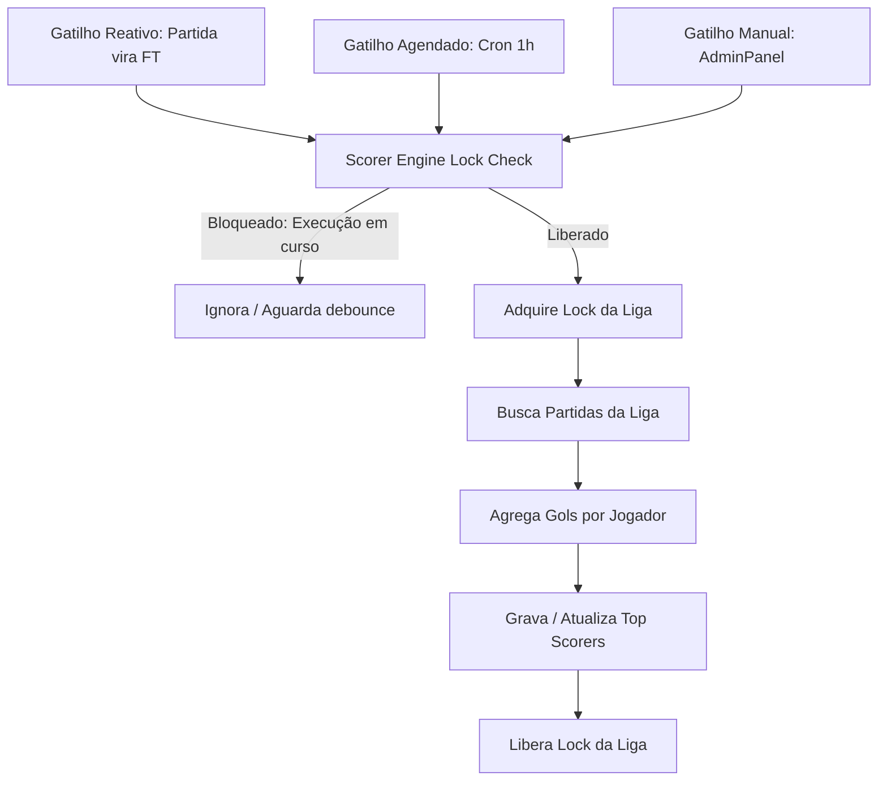

# Plano de Implementação: Agente Geral de Artilharia Automática (Scorer Engine)

**Data:** 22 de Agosto de 2026  
**Status:** Proposto / Planejado  
**Escopo:** Multi-módulos (Europa, Estaduais, Brasileirão, Copas) e AdminPanel  

---

## 1. Visão Geral e Objetivos

Atualmente, o cadastro e manutenção de artilheiros das ligas no ZapScore pode ser feito manualmente pelo AdminPanel. Com o crescimento da quantidade de ligas e aplicativos white-label (Premier League, La Liga, Serie A, Bundesliga, Ligue 1, Estaduais, etc.), o preenchimento manual torna-se operacionalmente inviável e sujeito a atrasos.

Este plano estabelece a criação de um **Agente Geral Centralizado e Idempotente de Artilharia**, capaz de:
1. Varrer eventos reais de gols de todas as partidas de uma liga.
2. Consolidar os totais de cada jogador (gols regulares, pênaltis, assistências, time).
3. Atualizar a tabela/coleção de artilharia de forma 100% segura, sem duplicar gols e permitindo auto-correções retroativas.
4. Operar via **Gatilho Reativo (Fim de Jogo - FT)**, **Gatilho Agendado (Cron de 1h)** e **Gatilho Manual (Botão no AdminPanel)**.

---

## 2. Arquitetura do Agente

### 2.1 Modelo Idempotente (Full-State Aggregation)
Em vez de usar operadores cumulativos incrementais (`gols += 1`), o agente utiliza **Reconstrução Baseada em Eventos Reais**:

```
[ Partidas da Liga (Matches) ] 
             │
             ▼
[ Filtro de Eventos: type == 'goal' && detail != 'Own Goal' ]
             │
             ▼
[ Agregação em Memória por Player ID / Nome ]
  ├── Total de Gols
  ├── Gols de Pênalti
  ├── Assistências (se disponível)
  └── Time Atual
             │
             ▼
[ Ordenação: Maior Gols ➔ Menos Pênaltis ➔ Nome ]
             │
             ▼
[ Sobrescrita Atômica na Coleção 'top_scorers' da Liga ]
```

### Vantagens:
- **Zero risco de duplicação**: Rodar 1 ou 1000 vezes gera exatamente o mesmo resultado consolidado.
- **Histórico Passado Contemplado**: Processa jogos passados, presentes e futuros naturalmente.
- **Auto-Correção Instantânea**: Se um gol for editado/anulado no AdminPanel, a artilharia reflete a correção na próxima execução.

---

## 3. Estratégia de Disparo e Concorrência



### 3.1 Tratamento de Concorrência (Lock / Debounce)
Para evitar processamento simultâneo redundante caso um cron coincida com o término `FT` de uma partida:
- **Lock em Memória por Liga (`syncLock[leagueId]`)**: Se uma sincronização da Premier League estiver em andamento, novas chamadas para essa mesma liga retornam imediatamente ou aguardam 5 segundos.
- **Debounce de 30 segundos**: Impede múltiplos disparos caso 3 partidas da mesma rodada terminem no mesmo minuto.

---

## 4. Estrutura de Dados e Regras de Negócio

### 4.1 Regras de Contagem:
- **Gol Válido**: Eventos do tipo `goal` com `detail` normal ou `penalty`.
- **Gol Contra (`Own Goal`)**: Não é creditado ao jogador que marcou contra para fins de artilharia da equipe/jogador.
- **Desempate**:
  1. Maior número de gols totais (`goals`).
  2. Menor número de gols de pênalti (`penalties`).
  3. Ordem alfabética do nome do jogador.

### 4.2 Schema do Objeto de Artilheiro:
```json
{
  "league_id": "premierleague",
  "season": "2026",
  "player_id": "player_haaland_9",
  "player_name": "Erling Haaland",
  "player_photo": "https://.../haaland.png",
  "team_id": "team_man_city",
  "team_name": "Manchester City",
  "team_badge": "https://.../mancity.png",
  "goals": 18,
  "penalties": 3,
  "assists": 5,
  "rank": 1,
  "updated_at": "2026-08-22T12:00:00Z"
}
```

---

## 5. Implementação por Módulos

### 5.1 Backend / Motor de Agregação (`scorer_engine.js`)
Função central reutilizável:
- `syncLeagueTopScorers(leagueId, options)`:
  - Carrega todas as partidas da temporada ativa daquela `leagueId`.
  - Agrega e ordena os artilheiros.
  - Atualiza em lote (batch upsert) os registros na base.

### 5.2 PocketBase Hooks / Reativo (`pb_hooks/scorer_sync.pb.js`)
- Escuta o evento `onRecordAfterUpdateSuccess` na coleção de partidas.
- Se `status` mudou para `FT` (Finalizado) ou se eventos de gols foram modificados:
  - Dispara `syncLeagueTopScorers(record.get("league_id"))`.

### 5.3 Tarefa Agendada (Cron)
- Executa a cada 60 minutos (ou de madrugada / após rodadas).
- Itera sobre a lista de ligas ativas: `['premierleague', 'laliga', 'seriea-italia', 'bundesliga', 'ligue1-franca', 'estaduais']`.

### 5.4 Integração no AdminPanel
- **Aba Artilharia**:
  - Exibe a lista atual de artilheiros com opção de edição manual.
  - Adiciona o botão **"⚡ Sincronizar Artilharia Automaticamente"**.
  - Mostra badge com status da última sincronização (ex: *"Atualizado automaticamente há 12 min"*).

---

## 6. Plano de Verificação e Testes

1. **Teste de Partidas Passadas**:
   - Rodar o script para a Premier League contendo 20+ jogos anteriores e verificar se a tabela de artilharia é preenchida perfeitamente com todos os autores de gols.
2. **Teste de Idempotência**:
   - Executar o script 3 vezes consecutivas e assegurar que nenhum jogador teve os gols duplicados ou somados incorretamente.
3. **Teste de Reatividade (FT)**:
   - Simular o encerramento de um jogo com gol recém-marcado e verificar a atualização automática em tempo real.
4. **Teste de Concorrência**:
   - Disparar simultaneamente o Cron e o evento FT para a mesma liga e validar a proteção por Lock.
