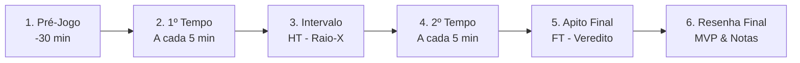
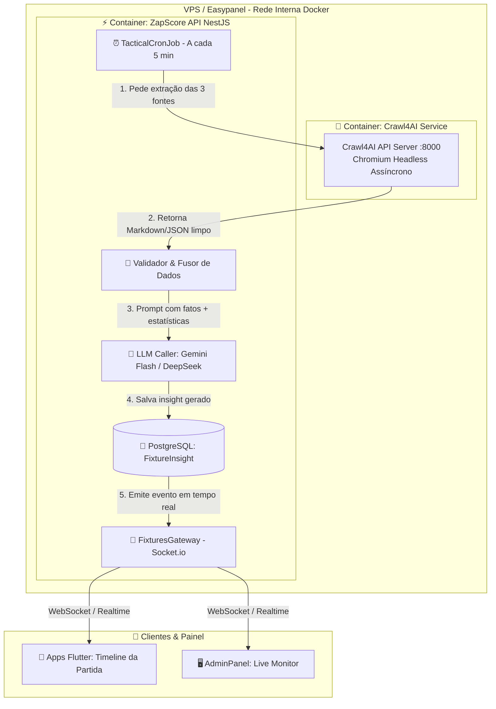

# 🎙️ Plano de Implementação — Agente de Comentários Táticos ao Vivo & Coleta Multi-Fontes (Crawl4AI + LLM Engine)

> **Data de Criação:** 26/08/2026  
> **Status:** `[A FAZER - PLANEJADO PARA AVALIAÇÃO DE IMPLANTAÇÃO 🚀]`  
> **Módulos Envolvidos:** `apps/api` (Worker Crawl4AI + NestJS Hub), `relatorios/ECOSYSTEM.md`, `apps/web` (AdminPanel Monitor), Clientes Flutter (`apps/estaduais/*`, `apps/europa/*`, `apps/mobile`).

---

## 🎯 1. Visão Geral e Proposta de Valor

O **Agente de Comentários Táticos ao Vivo** é um motor de inteligência esportiva autônomo projetado para transformar o acompanhamento de jogos no ZapScore em uma experiência imersiva de **transmissão escrita interativa com análises táticas em tempo real**.

### 🌟 Diferenciais Competitivos:
* **Não é apenas narração de lances ("X chutou a gol"):** É um **comentarista tático inteligente** que analisa esquemas táticos, pressão alta, desvios defensivos, mapa de calor estatístico e impacto das alterações de técnicos.
* **Cadência Contínua de 5 em 5 Minutos:** Gera entre 20 a 25 análises distribuídas em 6 fases cronológicas por jogo.
* **Validação Cruzada Tripla (Crawl4AI + API-Football):** Coleta em tempo real de 3 portais esportivos consagrados (*GE*, *Flashscore*, *UOL Esporte*), eliminando alucinações ao cruzar fatos com as estatísticas oficiais da partida.

---

## ⏱️ 2. Ciclo de Vida e Cadência dos Comentários

O agente opera em 6 fases bem definidas para cada partida monitorada:



| Fase | Minuto / Trigger | Conteúdo Gerado |
| :--- | :--- | :--- |
| **1. 📋 Pré-Jogo** | 30 a 15 min antes do início | Análise das escalações confirmadas, esquemas táticos (ex: 4-3-3 vs 3-5-2), desfalques e proposta inicial de jogo. |
| **2. ⚽ 1º Tempo** | **A cada 5 minutos**<br>*(5', 10', 15', 20', 25', 30', 35', 40', 45')* | Leitura do ritmo, intensidade das equipes, setores de pressão, chances perigosas e postura defensiva. |
| **3. ⏸️ Intervalo** | Status `HT` (Intervalo) | Raio-X estatístico consolidado (posse de bola, finalizações certas, desarmes) e diagnóstico do que precisa mudar. |
| **4. 🔥 2º Tempo** | **A cada 5 minutos**<br>*(50', 55', 60', 65', 70', 75', 80', 85', 90'+)* | Análise do impacto das substituições, cansaço físico, transições rápidas e desfecho dramático nos acréscimos. |
| **5. 🏁 Apito Final** | Status `FT` (Fim de Jogo) | Veredito instantâneo do confronto e mérito do placar. |
| **6. 🏆 Resenha Final** | Pós-Jogo (+5 min pós FT) | Crônica esportiva completa, eleição dos **Melhores em Campo (MVP)**, notas dos técnicos e impacto na tabela. |

---

## 🏗️ 3. Arquitetura Técnica & Topologia no Easypanel (VPS)



---

## 🐳 4. Especificação do Microserviço Crawl4AI no Easypanel

* **Imagem Docker:** `unclecode/crawl4ai:latest`
* **Rede Interna:** Conectado à bridge interna `zapscore_network` do Docker no Easypanel.
* **Porta Interna:** `8000` (Acessível pelo backend via `http://crawl4ai:8000/crawl`, **sem exposição pública na internet** para máxima segurança).
* **Consumo de Recursos:** Limite de 0.5 vCPU e 512MB a 1GB de RAM (muito leve para a VPS).
* **Contrato de API Interna:**
  ```json
  POST http://crawl4ai:8000/crawl
  {
    "urls": [
      "https://ge.globo.com/.../tempo-real/...",
      "https://www.flashscore.com.br/jogo/.../#/resumo-de-jogo",
      "https://www.uol.com.br/esporte/futebol/central-de-jogos/..."
    ],
    "priority": "speed",
    "extraction_strategy": "markdown_blocks"
  }
  ```

---

## 🤖 5. Custos, Escalabilidade e Seleção da LLM

| Provedor / Modelo | Tempo de Resposta | Custo por 1M Tokens (Entrada / Saída) | Custo Estimado por Jogo (25 insights) |
| :--- | :--- | :--- | :--- |
| **Google Gemini 1.5 Flash** | ~400ms - 800ms | $0.075 / $0.30 | **~$0.005 (Meio centavo de dólar)** |
| **DeepSeek V3 (DeepSeek Chat)** | ~600ms - 1.2s | $0.14 / $0.28 | **~$0.007** |

> 💡 **Estimativa de Escala:** Uma rodada cheia de 10 jogos simultâneos (250 comentários táticos com 3 fontes cruzadas) custará **menos de R$ 0,35 no total**!

---

## 🗄️ 6. Modelo de Dados Prisma (`apps/api/prisma/schema.prisma`)

```prisma
model FixtureInsight {
  id          String   @id @default(uuid())
  fixtureId   Int      // ID numérico da partida
  minute      Int      // Minuto do jogo (ex: 5, 10, 45, 90)
  phase       String   // "PRE_MATCH", "1H", "HT", "2H", "FT", "POST_MATCH"
  title       String   // Título curto (ex: "Pressão sufocante do Grêmio pelo lado direito")
  comment     String   // Texto analítico rico de 2 a 3 frases
  sentiment   String   // "NEUTRAL", "INTENSE", "HOME_DOMINANCE", "AWAY_DOMINANCE", "GOAL", "RED_CARD"
  statsSnapshot Json?  // Snapshot das estatísticas naquele minuto { homePossession: 62, shots: 4, ... }
  mvpPlayers  Json?    // Array com os melhores em campo (na fase POST_MATCH)
  createdAt   DateTime @default(now())

  @@index([fixtureId, minute])
  @@index([fixtureId, phase])
}
```

---

## 📱 7. Experiência do Usuário no Flutter (`apps/estaduais/*`, `apps/europa/*`, `apps/mobile`)

### Nova Aba na Tela de Detalhes do Jogo (`FixtureDetailScreen`):
* **Aba "Comentários & IA"**:
  * Timeline vertical moderna e fluida com cards enriquecidos.
  * Ícones visuais dinâmicos por tipo de lance/fase (📋 Pré-Jogo, 🔥 Pressão, ⚽ Gol/Análise, ⏸️ Intervalo, 🏆 Resenha).
  * Conexão via **WebSocket (Socket.io)** para receber novos insights da IA instantaneamente sem necessidade de recarregar a tela.
  * Indicador sutil de digitação/análise (*"IA analisando os últimos 5 minutos..."*).

---

## 📋 8. Roteiro de Implementação em 5 Fases

### Fase 1: Setup do Container Crawl4AI no Easypanel
- [ ] Criar serviço `crawl4ai` no Easypanel com a imagem `unclecode/crawl4ai:latest` na rede interna Docker.
- [ ] Validar endpoint interno `http://crawl4ai:8000/crawl` via script de teste no backend.

### Fase 2: Modelo de Dados e Endpoints na ZapScore API
- [ ] Adicionar model `FixtureInsight` no schema Prisma da `apps/api` e executar migration.
- [ ] Criar `FixtureInsightsService` e rotas `GET /fixtures/:id/insights`.
- [ ] Integrar broadcast no `FixturesGateway` (WebSocket `fixture-insight-new`).

### Fase 3: Orquestrador da LLM e Prompts Táticos
- [ ] Implementar serviço de fusão de dados e chamadas ao Gemini 1.5 Flash / DeepSeek com formatação estrita em JSON.
- [ ] Configurar cron de 5 minutos que monitora partidas com status `LIVE` ou `HT`.

### Fase 4: Tela de Monitoramento no AdminPanel
- [ ] Criar `/adminpanel/agents/tactical-insights` com feed ao vivo de insights para conferência e moderação do operador.

### Fase 5: Integração nos Clientes Flutter
- [ ] Implementar `InsightsCubit` e widget `TacticalTimelineWidget` nos aplicativos mobile.
- [ ] Validar consumo em dispositivo real com partidas ao vivo.

---

> 📌 **Governança:** Este plano de ação está integrado como tarefa pendente oficial no **Capítulo 15** do [`relatorios/ECOSYSTEM.md`](file:///d:/zapscore/relatorios/ECOSYSTEM.md).
