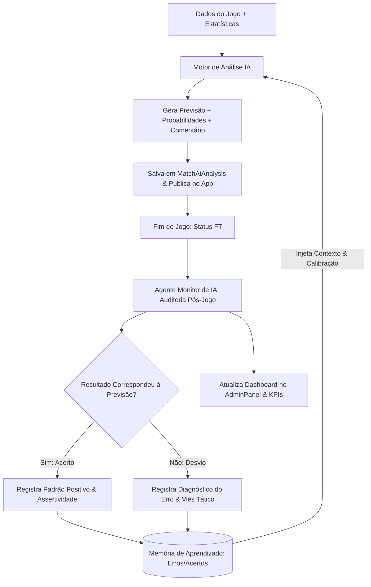

# Plano de Implementação: Agente Monitor de IA (AI Sentinel & Performance Engine)

**Data:** 22 de Agosto de 2026  
**Status:** Proposto / Planejado  
**Escopo:** AdminPanel Next.js (`apps/web/app/(main)/adminpanel/agents/ia-monitor/page.tsx`), Hub de Agentes (`apps/web/app/(main)/adminpanel/agents/page.tsx`), Backend API (`apps/api`) e Integração com LLMs (Gemini / OpenAI)  

---

## 1. Visão Geral e Objetivos

Com a introdução de análises táticas, probabilidades de vitória e palpites automáticos gerados por Inteligência Artificial no ecossistema do ZapScore, torna-se essencial um agente supervisor dedicado a governar e otimizar essa esteira.

O **Agente Monitor de IA** será integrado diretamente dentro do módulo existente de **Agentes** no AdminPanel Next.js (`/adminpanel/agents/ia-monitor`) com os seguintes objetivos:
1. **Auditoria de Qualidade dos Comentários:** Monitorar a integridade textual, coerência tática e ausência de alucinações nas análises entregues aos usuários.
2. **Acompanhamento de Performance e Acurácia Preditiva:** Medir o percentual real de acerto pós-jogo (probabilidades, mercado de gols, ambos marcam, etc.).
3. **Observabilidade e Gestão de Infraestrutura (API Key & Usage):** Monitorar latência, consumo de tokens, status da chave de API e limites de taxa (RPM / Cotas mensais).
4. **Motor de Aprendizado Contínuo (Feedback Loop):** Catalogar erros e acertos de partidas passadas e retroalimentar novos prompts dinamicamente (*Dynamic Few-Shot*), elevando progressivamente o índice de assertividade das previsões.

---

## 2. Arquitetura do Agente e Ciclo de Aprendizado

O fluxo operacional do agente compreende desde a geração pré-jogo até a retroalimentação com base no placar final:



---

## 3. Interface no AdminPanel Next.js (`/adminpanel/agents/ia-monitor`)

O painel será construído em React/Next.js com Tailwind CSS, ícones `lucide-react` e suporte a temas escuros no padrão ZapScore:

### 3.1 Grid Superior de KPIs & Status de Infraestrutura (5 Cards)

1. **Taxa de Assertividade Geral:**
   * Métrica em destaque (ex: `78.4% de acertos`).
   * Subtítulo: Histórico móvel dos últimos 30 dias (Vitórias, Over/Under, Ambas Marcam).
2. **Análises Geradas Hoje:**
   * Volume diário de partidas cobertas (ex: `14 partidas analisadas`).
   * Indicador de cobertura da rodada.
3. **Latência Média & Consumo de Tokens:**
   * Tempo médio de resposta e volume consumido (ex: `1.2s | 42.5k tokens`).
   * Gráfico de tendência diária.
4. **Alertas de Inconsistência:**
   * Falhas de parsing de JSON, rejeições de prompt ou respostas vazias (ex: `0 falhas`).
5. **Status da API Key & Usage:**
   * Indicador visual de integridade (`● Ativa / Healthy`).
   * Medidor de cota utilizada e limites de requisições por minuto (`RPM: 12/60 | Cota: 18%`).

---

### 3.2 Tabela de Auditoria de Partidas & Previsões

Visualização detalhada de todas as análises geradas pelo sistema com filtros por data, liga e status:

* **Colunas da Tabela:**
  * **Partida:** Confronto, data/hora e competição (ex: *Flamengo vs Palmeiras - Brasileirão*).
  * **Previsão & Probabilidades:** Resumo curto e distribuição percentual (*Casa % / Empate % / Fora %*).
  * **Dicas Sugeridas:** Badges com os palpites (ex: `+2.5 Gols`, `Ambos Marcam`).
  * **Status Pós-Jogo:**
    * ⏳ *Aguardando Início*
    * 🟢 *Acertou (Vitória Casa 2x1)*
    * 🔴 *Desvio Identificado (Empate 1x1)*
  * **Ações Administrativas:**
    * 🔄 **Regenerar Análise:** Força novo processamento incorporando escalações oficiais atualizadas.
    * 🔍 **Auditar Prompt:** Abre modal com o payload exato enviado à LLM e a resposta bruta retornada.

---

### 3.3 Motor de Aprendizado & Diagnóstico de Vieses

Seção dedicada ao aperfeiçoamento contínuo das previsões:

* **Painel de Padrões Identificados:**
  * Lista de tendências aprendidas pelo modelo (ex: *"Dicas de 'Ambos Marcam' na Premier League: 85% de eficácia"* ou *"Identificada superestimação de favoritismo de mandantes em clássicos regionais"*).
* **Calibração de Pesos:**
  * Ajuste automático dos multiplicadores de probabilidade baseado na taxa de acerto histórica.
* **Ação de Recalibração Manual:** Botão para reavaliar o histórico de um campeonato e atualizar o banco de memória.

---

### 3.4 Console de Eventos, Logs & Feedback em Tempo Real

* **Terminal Interativo:** Stream dos eventos de geração disparados pelos cron jobs e webhooks.
* **Filtros Rápidos:** `Todos os Logs`, `Erros / Timeouts`, `Gerações com Sucesso`, `Auditorias Pós-Jogo`.
* **Controles:** Botão para limpar console e exportar relatório de performance em JSON/CSV.

---

## 4. Estrutura de Banco de Dados e Persistência

Para viabilizar a auditoria e o aprendizado contínuo, serão estruturadas as seguintes entidades no backend:

### 4.1 `MatchAiAnalysis` (Previsão e Auditoria)
```prisma
model MatchAiAnalysis {
  id                  String    @id @default(uuid())
  matchId             String    @unique
  match               Match     @relation(fields: [matchId], references: [id], onDelete: Cascade)
  
  // Previsões Geradas
  probHome            Int
  probAway            Int
  probDraw            Int
  predictionSummary   String
  tips                String[]
  commentary          String    @db.Text
  
  // Auditoria Pós-Jogo
  isAudited           Boolean   @default(false)
  auditResult         String?   // "HIT", "MISS", "PARTIAL"
  actualOutcome       String?   // "HOME_WIN", "AWAY_WIN", "DRAW"
  accuracyScore       Float?    // 0.0 a 100.0
  auditNotes          String?   // Diagnóstico do agente
  
  createdAt           DateTime  @default(now())
  updatedAt           DateTime  @updatedAt

  @@map("match_ai_analysis")
}
```

### 4.2 `AiLearningMemory` (Banco de Aprendizado e Vieses)
```prisma
model AiLearningMemory {
  id            String    @id @default(uuid())
  leagueId      String?
  teamId        String?
  category      String    // "OUTCOME", "GOALS_OVER_UNDER", "BOTH_TEAMS_SCORE"
  totalTested   Int       @default(0)
  totalHits     Int       @default(0)
  biasFactor    Float     @default(1.0) // Fator de ajuste de peso
  insights      String[]  // Array de observações táticas aprendidas
  updatedAt     DateTime  @updatedAt

  @@map("ai_learning_memories")
}
```

### 4.3 `AiUsageLog` (Métricas de Infraestrutura)
```prisma
model AiUsageLog {
  id            String    @id @default(uuid())
  provider      String    // "GEMINI" ou "OPENAI"
  modelName     String    // "gemini-1.5-flash", "gemini-1.5-pro", etc.
  promptTokens  Int
  outputTokens  Int
  totalTokens   Int
  latencyMs     Int
  statusCode    Int       // 200, 429, 500
  errorMessage  String?
  createdAt     DateTime  @default(now())

  @@map("ai_usage_logs")
}
```

---

## 5. Estratégia de Aprendizado com Histórico (*Dynamic Few-Shot*)

Ao montar o prompt para um novo jogo, o serviço de IA executa a seguinte injeção contextual:

1. **Busca na Memória:** Consulta os últimos 5 confrontos e índices daquela liga/times em `AiLearningMemory`.
2. **Injeção no System Prompt:**
   ```markdown
   [DIRETRIZ DE CALIBRAÇÃO HISTÓRICA]
   - Nas últimas rodadas desta competição, o modelo apresentou viés de superestimar placares altos (+3.5 gols) quando o Time Visitante joga com formação defensiva.
   - Assertividade atual nesta liga: 81.2%.
   - Aplique rigor extra nas probabilidades de empate quando os dois times tiverem médias de posse similares.
   ```
3. **Auto-Correção:** O modelo pondera a análise atual com base nas lições do histórico, reduzindo reincidência de erros.

---

## 6. Arquivos e Rotas a Criar / Modificar

1. **[MODIFY]** `apps/web/app/(main)/adminpanel/agents/page.tsx`:
   * Adicionar card do **Monitor de IA** com status online, atalho `/adminpanel/agents/ia-monitor` e métricas em tempo real.
2. **[NEW]** `apps/web/app/(main)/adminpanel/agents/ia-monitor/page.tsx`:
   * Página dedicada e interativa do Monitor de IA com os 5 cards de KPIs, tabela de auditoria com filtros, modal de auditoria de prompt e console de logs em tempo real.

---

## 7. Critérios de Sucesso
- [x] Card do Monitor de IA integrado perfeitamente ao Hub de Agentes em `/adminpanel/agents`.
- [x] Dashboard dedicado em `/adminpanel/agents/ia-monitor` com visual premium, responsivo e em conformidade com o design system do ZapScore.
- [x] Controles de auditoria de previsões, status de API Key & Usage e console de feedback funcional.
