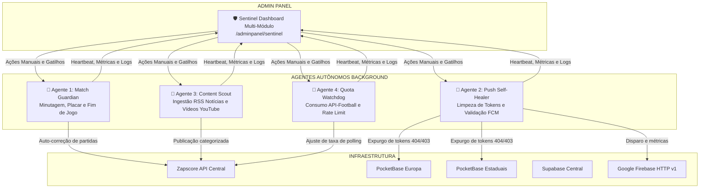

# Plano de Implementação: Expansão do Sentinel & Ecossistema de Agentes Autônomos ZapScore
**Data:** 16 de Agosto de 2026  
**Status:** Planejamento e Especificação Técnica  
**Autor:** Antigravity AI Pair Programmer  

---

## 1. Visão Geral e Objetivos

O ecossistema ZapScore opera com múltiplos módulos autônomos (Europa, Estaduais, Brasileirão, Copas), cada um com suas particularidades de dados, notificações push e integrações.

Este plano define a evolução do **Sentinel** de um monitor isolado do Brasileirão para a **Central de Comando e Auditoria Unificada**, combinada a uma **rede de 4 Agentes Autônomos Especializados** operando em segundo plano para auto-correção, curadoria de conteúdo e proteção de infraestrutura.



---

## 2. Fase 1: Expansão do Sentinel (AdminPanel Multi-Módulo)

### 2.1. Seletor de Escopo Dinâmico (Tabs / Dropdown)
* **Objetivo:** Permitir ao operador filtrar a auditoria instantaneamente entre:
  * 🌐 **Visão Global (Todos)**: Agrega todas as partidas do dia e status de todos os módulos.
  * 🇪🇺 **Módulo Europa**: Bundesliga (78), La Liga (140), Premier League (39), Serie A (135), Ligue 1 (61).
  * 🏆 **Módulo Estaduais**: Mineiro 1 (629), Mineiro 2 (619), Carioca A (624), Carioca A2 (851), Paulista A1 (475), Paulista A2 (476).
  * 🇧🇷 **Módulo Brasileirão**: Série A (71), Série B (72).
  * ⭐ **Copas**: Libertadores (13), Champions League (2), Copa do Brasil (73).

### 2.2. Grid de Saúde Multi-Nó (Health Checks)
Monitorar os 4 pilares de dados com latência e status visual (🟢 Saudável, 🟡 Alerta, 🔴 Falha):
1. **Zapscore API Central**: `GET /sentinel/health-check` (Uptime, versão, conexões Prisma).
2. **PocketBase Europa**: `GET https://zapscore-pocketbase-europa.gtalg3.easypanel.host/api/health` (Hooks FCM ativos).
3. **PocketBase Estaduais**: `GET https://zapscore-pocketbase-estaduais.../api/health` (Status do serviço).
4. **PostgreSQL / Supabase**: Latência de queries e contagem de conexões ativas.

### 2.3. Painel de Jogos em Tempo Real Multi-Liga
* Consulta `/fixtures/today?leagueId=...` ou `/fixtures/today` global.
* Exibição de cards com bandeiras, minuto em tempo real, placar e status (`1H`, `2H`, `HT`, `LIVE`, `FT`).

---

## 3. Fase 2: Implementação dos 4 Agentes Autônomos

### 🤖 Agente 1: *Match Guardian* (Autocorreção de Partidas)
* **Responsabilidade:** Garantir que nenhuma partida fique travada em minutagem ou com status incorreto.
* **Lógica de Decisão:**
  1. A cada 60s, lista todas as partidas com status `LIVE`, `1H`, `2H`, `HT`.
  2. Se uma partida estiver em `2H` com minutagem $\ge 115'$:
     * Consulta endpoint de detalhes `/fixtures/:id` para confirmar encerramento.
     * Se confirmado término, atualiza status para `FT` e aciona o evento de fim de jogo para disparo do push.
  3. Se uma partida estiver como `NS` (Não Iniciada) mas o horário de início já passou há mais de 5 minutos, força consulta de status para virar `1H`.

### 🤖 Agente 2: *Push Self-Healer* (Saúde e Limpeza de Notificações)
* **Responsabilidade:** Garantir taxa de entrega de 100% e manter os bancos de assinantes limpos.
* **Lógica de Decisão:**
  1. Ao disparar uma notificação via FCM HTTP v1:
     * Se resposta for `404 NotRegistered` ou `UNREGISTERED`: remove o registro da coleção `subscriptions` imediatamente.
     * Se resposta for `403 SenderIdMismatch`: remove o token do projeto incorreto.
  2. Mantém estatísticas reais de envio: `Total Inscritos`, `Tokens Válidos`, `Tokens Expurgrados Hoje`, `Taxa de Sucesso (%)`.
  3. Verifica a validade do token OAuth2 RS256 e executa renovação proativa 5 minutos antes da expiração.

### 🤖 Agente 3: *Content Scout* (Curadoria de Notícias e Vídeos)
* **Responsabilidade:** Manter as abas de Notícias e Vídeos de todos os módulos sempre atualizadas automaticamente.
* **Lógica de Decisão:**
  1. A cada 30 minutos, varre os feeds RSS esportivos (Globo Esporte, UOL, Bild, Kicker, Marca, BBC, etc.) cadastrados em `news_sources`.
  2. Aplica filtro de relevância por palavras-chave e nomes dos clubes para associar o `leagueId` correto.
  3. Verifica hash anti-duplicação (título/URL); se inédita, grava na API (`POST /news`).
  4. Varre canais oficiais do YouTube cadastrados para coletar vídeos de melhores momentos pós-jogo e grava na API (`POST /videos`).

### 🤖 Agente 4: *Quota & Latency Watchdog* (Guardião de Custos e Infraestrutura)
* **Responsabilidade:** Evitar estouro de limites na API-Football e prevenir lentidão.
* **Lógica de Decisão:**
  1. Monitora o header `x-requests-remaining` da API-Football.
  2. **Modo Normal:** Polling de jogos ao vivo a cada 15-30s.
  3. **Modo Econômico Inteligente (se cota restante < 20%):**
     * Polling a cada 60s em jogos com placar dilatado (>2 gols de diferença).
     * Mantém polling de 20s apenas em jogos nos minutos finais (80'+) ou placares empatados.
  4. Registra picos de latência e gera alertas no Sentinel.

---

## 4. Fase 3: Matriz de Agentes no Dashboard do Sentinel

Na interface do `/adminpanel/sentinel`, será adicionada a seção **"Matriz de Agentes Autônomos"**:

| Componente na UI | Descrição |
|---|---|
| **Card Status do Agente** | Badge visual (`ONLINE`, `STANDBY`, `RETRY`, `ALERT`) e última execução. |
| **Métricas de Ação** | Contadores do dia: Partidas corrigidas, Tokens limpos, Notícias inseridas, Requisições salvas. |
| **Console de Logs ao Vivo** | Terminal no estilo retro-dark exibindo os eventos disparados pelos agentes em tempo real. |
| **Botões de Controle** | `[Executar Agora]`, `[Pausar Agente]`, `[Limpar Logs]`. |

---

## 5. Roteiro Passo a Passo de Execução

```
[Etapa 1] - Atualização do Sentinel no AdminPanel (Tabs de Módulos, Health Checks Multi-Nó)
     │
[Etapa 2] - Criação do Módulo de Agentes na Zapscore API (/sentinel/agents)
     │
[Etapa 3] - Implementação do Agente 1 (Match Guardian) e Agente 2 (Push Self-Healer)
     │
[Etapa 4] - Implementação do Agente 3 (Content Scout RSS/Vídeos) e Agente 4 (Quota Watchdog)
     │
[Etapa 5] - Conexão dos Agentes com o Terminal de Logs do Sentinel
     │
[Etapa 6] - Testes Integrados e Deploy no Servidor (Easypanel / Swarm)
```

---

## 6. Conclusão

Com este plano, o ZapScore atinge **maturidade de plataforma corporativa**:
- **Zero Operação Manual:** Partidas travadas, tokens mortos e falta de notícias são resolvidos autonomamente pelos agentes.
- **Visibilidade Total:** Qualquer anomalia em qualquer um dos módulos (Europa, Estaduais ou Brasil) é identificada instantaneamente no Sentinel.
- **Eficiência de Custos:** Proteção contra consumo excessivo de APIs pagas com comutação de modo econômico.
